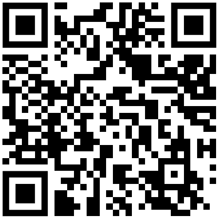

# καλως ΗΡΘΑΤΕ

Γεια σας και καλώς ήρθατε στο "Box"! Όταν ταξιδεύω, μου αρέσει επίσης να μένω σε AirBnB και μερικές φορές εύχομαι να είχα ένα χαρτί με όλες τις απαραίτητες πληροφορίες για τη διαμονή, το check-in και το check-out και αυτή είναι η προσπάθειά μου να το κάνω καλύτερο.

## Εικόνες

Στο AirBnB μου έχετε μια λεπτομερή επισκόπηση όλων των δωματίων και των εγκαταστάσεων. Εδώ είναι μόνο μια σύντομη επισκόπηση:

|           |    |  |
| -------------------------------------------------------------------------------------- | ----------------------------------------------------------------------------- | --------------------------------------------------------------------------------------- |
| Διαμόρφωση ενός κρεβατιού με καναπέ                                                    | Διαμόρφωση δύο κρεβατιών                                                      | Γραφείο                                                                                 |
|  |            |                          |
| Γραφείο με φως                                                                         | Κουζίνα - σόμπα                                                               | Κουζίνα - τσάι                                                                          |
|            |  |            |
| Γραφείο με φως                                                                         | Κουζίνα - σόμπα                                                               | Κουζίνα - τσάι                                                                          |

# Checkin

## Κλειδί

Παίρνετε δύο ζευγάρια κλειδιά, το καθένα με ένα κλειδί για το κάτω μέρος και ένα για το επάνω μέρος. Υπάρχει επίσης ένα κλειδί σε ένα μπρελόκ που μπορείτε να χρησιμοποιήσετε για να κλειδώσετε το δωμάτιό σας.

## πρόσβαση στο διαδίκτυο

```txt
SSID:     hamburg-bei-nacht
Passwort: landungsbruecken
```

Ή σαρώνετε αυτόν τον κωδικό QR, θα σας συνδέσει αυτόματα στο δίκτυο:



# Τα δωμάτια

!\[[thebox-map.png]]

## Κουζίνα

Δεδομένου ότι συνήθως τρώω κάτω με την οικογένειά μου, η κουζίνα είναι πολύ σπαρταριστή. Δυστυχώς, το πλύσιμο μπορεί να γίνει μόνο στο νεροχύτη στο μπάνιο. Αλλά υπάρχει ένα ειδικό δοχείο για το πλύσιμο.


### Τα ακόλουθα πράγματα είναι διαθέσιμα σε εσάς

1.  Αγέλη
2.  Βραστήρας
3.  Μαχαιροπίρουνα πιάτων
4.  Ψυγείο
5.  Pizzaof
6.  Μεταλλικό νερό
7.  Σταθμός φόρτισης κινητού τηλεφώνου στο ράφι
8.  πλυντήριο

### Συχνές ερωτήσεις - Κουζίνα

1.  Η σόμπα δεν λειτουργεί; Παρακαλώ πείτε
    > "Υπολογιστής, πάγκος εργασίας και"
2.  Πού μπορώ να πλυθώ; Αυτό λειτουργεί μόνο στο μπάνιο. Υπάρχει ειδικό δοχείο για το πλύσιμο των πιάτων.

## Το δωμάτιό σου

Τα στρώματα τοποθετούνται το ένα πάνω στο άλλο μόνο για λόγους αποθήκευσης. Μπορείτε να τα διανείμετε ανάλογα με τις ανάγκες σας. Αν αντικαταστήσετε τα μαξιλάρια στον καναπέ με ένα στρώμα, κάνει ένα καλό κρεβάτι.

Μπορείτε να χρησιμοποιήσετε τον υπολογιστή και τον εκτυπωτή.

### Τα στοιχεία σύνδεσης για τον υπολογιστή είναι

```txt
Nutzer:   thebox
Passwort: thebox
```

### Τα ακόλουθα πράγματα είναι διαθέσιμα σε εσάς

1.  Όλα τα έπιπλα και τα κρεβάτια
2.  Υπολογιστή
3.  Τηλεχειριστήρια για φώτα και ρεύμα

### Τηλεχειριστήρια

| Απεικόνιση                                               | Περιγραφή                                                                                                            |
| -------------------------------------------------------- | -------------------------------------------------------------------------------------------------------------------- |
|  | Α: Bluetoothbox<br>B: Lichterkette<br>Γ: Επιτραπέζιο φωτιστικό<br>ΡΕ:_αρχείο_<br>Master: Αλλάξτε τα πάντα ταυτόχρονα |
|                                                          |                                                                                                                      |

### Συχνές ερωτήσεις - Το δωμάτιό σας

1.  Η λυχνία δεν ανάβει ούτε αναβοσβήνει τρελά. Χρησιμοποιήστε τα μικρά τηλεχειριστήρια με τα πολύχρωμα κουμπιά.

### τουαλέτα

Μπορείτε να χρησιμοποιήσετε το ντους ενώ στέκεστε. Δεν είναι πρόβλημα αν το έδαφος βραχεί λίγο. Γυρίστε το νερό μόνο στο 1/3 και κρεμάστε το χαλάκι μπάνιου πάνω από τη θερμάστρα για να στεγνώσει.

Η Alexa στον τοίχο ονομάζεται "Computer" και παίζει επίσης την αγαπημένη σας μουσική ή ραδιόφωνο. Π.χ. "_Υπολογιστής, παίξτε Deutschlandfunk Nova_"

Μπορείτε να κρεμάσετε πετσέτες σε όλους τους γάντζους και να τοποθετήσετε τα πράγματά σας οπουδήποτε.

### Διάδρομος

Είστε ευπρόσδεκτοι να αφήσετε τα παπούτσια σας εδώ. Έχω και ένα μικρό σημειωματάριο στο ράφι σε περίπτωση που θέλεις να μου πεις κάτι.

# Διάφορα

## Εξυπνο σπίτι

Υπάρχουν βοηθοί φωνής Alexa στο διαμέρισμα. Μπορείτε να τους απευθυνθείτε με το όνομα «Υπολογιστής» και να τους βάλετε να παίξουν την Deutschlandfunk Nova, για παράδειγμα. Οι συσκευές είναι συνδεδεμένες στο Διαδίκτυο και μπορούν επίσης να χρησιμοποιηθούν ως ξυπνητήρια ή χρονόμετρα. Εάν δεν θέλετε να το χρησιμοποιήσετε, μπορείτε απλά να το αποσυνδέσετε από το τροφοδοτικό.

Δεν υπάρχουν βοηθοί φωνής στο δωμάτιό σας. Το καλάθι στο ράφι περιέχει μόνο το δρομολογητή και έναν μικρό υπολογιστή.

## θερμοκρασία και υγρασία

Η θερμοκρασία και η υγρασία μετρώνται αυτόματα μέσω των αισθητήρων. Τα χρησιμοποιώ για να αποτρέψω το σχηματισμό μούχλας. Είναι μικρά και λευκά και συνήθως βρίσκονται στα κουφώματα της πόρτας. Μπορείτε να διαβάσετε μερικά από τα δεδομένα μέτρησης στον καθρέφτη στο διάδρομο.

> Φροντίστε να αερίζετε τακτικά (τουλάχιστον μία φορά την ημέρα). Ειδικά στο μπάνιο. Βεβαιωθείτε επίσης ότι η θέρμανση είναι απενεργοποιημένη. Σας ευχαριστώ 🙏

# Ολοκλήρωση αγοράς

## Κλειδί

-   Ανάλογα με το ποια μέρα της εβδομάδας είναι, μπορούμε να σας αποχαιρετήσουμε αυτοπροσώπως ή μπορείτε απλά να βάλετε τα κλειδιά στο γραφείο και να κλείσετε την πόρτα πίσω σας.
-   Η κανονική ώρα ταμείου είναι 11 π.μ.
-   Εάν θέλετε να αφήσετε τις αποσκευές σας πίσω την ημέρα της αναχώρησης και να τις παραλάβετε μόνο αργότερα μέσα στην ημέρα, μπορούμε να το κανονίσουμε μεμονωμένα.

## καθάρισμα

-   Μπορείτε να αφήσετε το κρεβάτι πάνω του.
-   Πλένω και τα πιάτα και
-   Βγάζω και τα σκουπίδια.

> Σύντομη έκδοση: Αφήστε το κλειδί εκεί, κλείστε την πόρτα, αυτό είναι. 😀

# Συμβουλές

Με την εφαρμογή Leipzig MOVE, λαμβάνετε 10 δωρεάν βόλτες των 15 λεπτών η καθεμία_Nextbikes_. Σημειώστε ότι κοστίζει περισσότερο αν δεν παρκάρετε τα ποδήλατά σας στους κεντρικούς δρόμους (μωβ στον χάρτη). Τα ηλεκτρονικά σκούτερ επιτρέπεται να σταθμεύουν μόνο σε ορισμένες θέσεις στάθμευσης.

# Ερωτήσεις;

Εάν έχετε οποιεσδήποτε ερωτήσεις ή χρειάζεστε υποστήριξη, θα χαρώ να σας βοηθήσω. Εάν βιάζεστε, καλύτερα να το κάνετε μέσω τηλεφώνου <a href="tel:+491707353067">+49 170 73 53 067</a>. Μπορείτε επίσης να χρησιμοποιήσετε την προεγκατεστημένη εφαρμογή messenger με περιορισμένη λειτουργικότητα (SMS). Διαφορετικά, έχω ένα σημειωματάριο και ένα στυλό στο διάδρομο.

Σας εύχομαι καλή διαμονή στη Λειψία!
Αντρέ

* * *

_Φτιαγμένο με ❤️ από [τεκμηριώνω](https://docsify.js.org/)_
