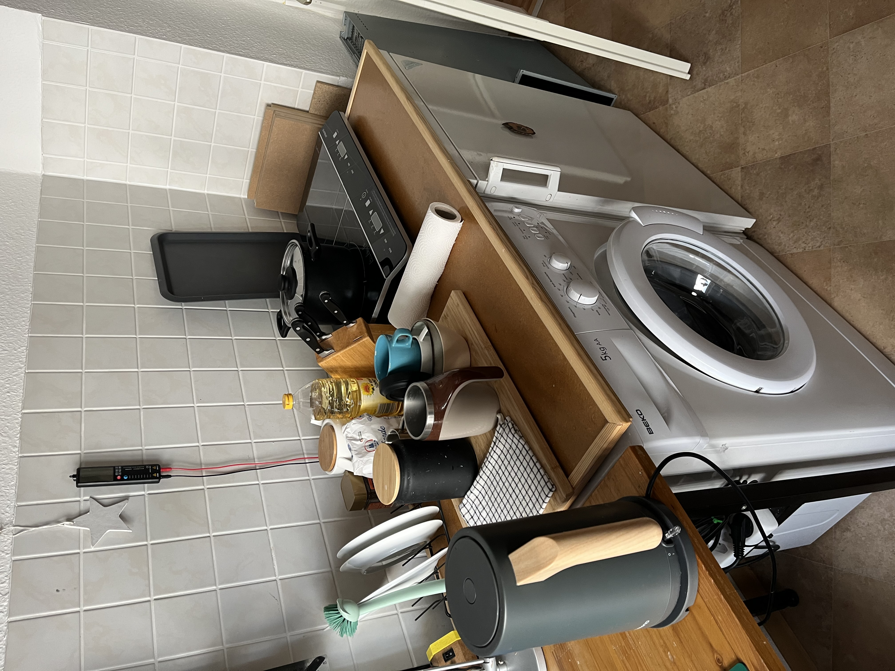
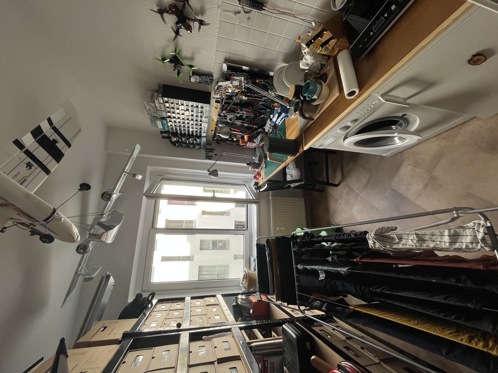
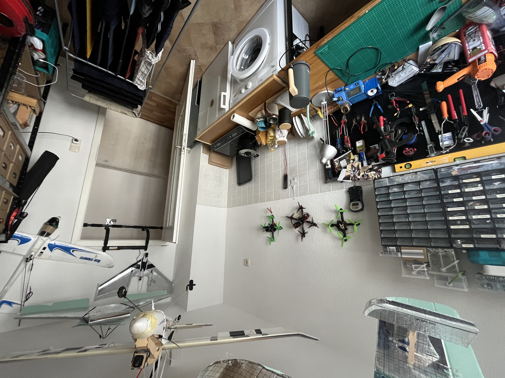
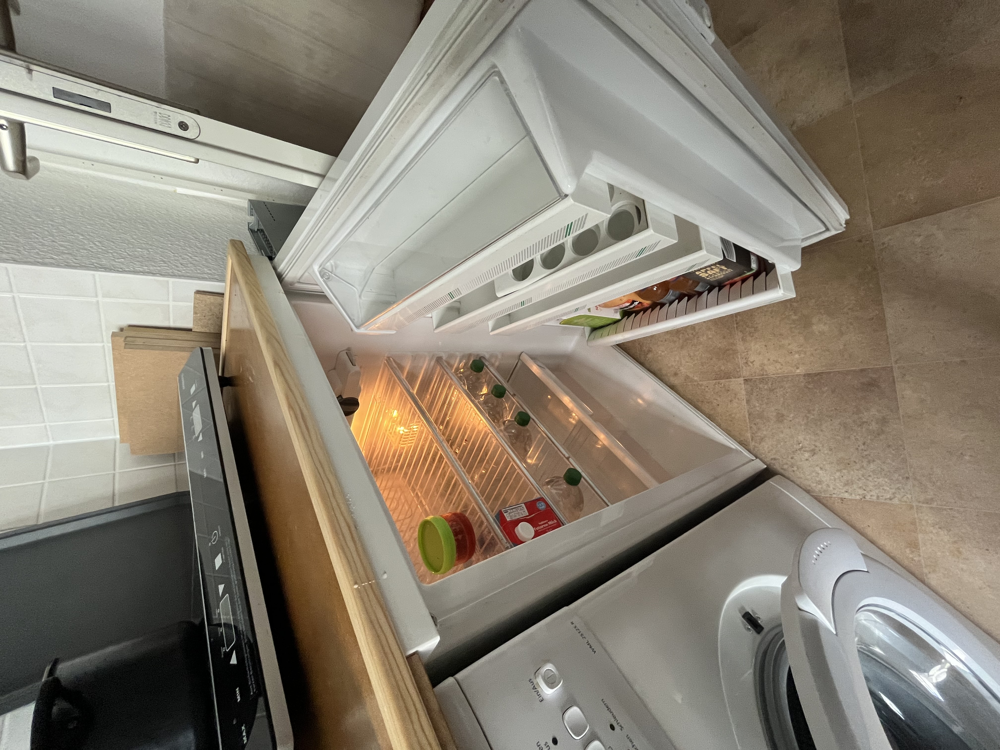

# TheBox

Hello and welcome to the “Box”! When I travel, I also like to stay in AirBnB's and sometimes I wish I had a piece of paper with all the necessary information about accommodation, check-in and check-out and this is my attempt to make it better:


## Checkin

### Key

You get two pairs of keys, each with one key for the bottom and one for the top. There is also a key on a key chain that you can use to lock your room.

### Internet access

```txt
SSID:     hamburg-bei-nacht
Passwort: landungsbruecken
```

Or you scan this QR code, it will automatically connect you to the network:

<<<<<<< HEAD

=======
\|


>>>>>>> a2260d1 (refactor: Folder structure)

## The rooms


### Küche

Since I usually eat downstairs with my family, the kitchen is very spartan. Unfortunately, washing up can only be done in the sink in the bathroom. But there is a special container for washing up.

|               |  |
| ---------------------------------------------------------- | ---------------------------------------------------------- |
|  |  |

**The following things are available to you:**

1.  Herd
2.  Kettle
3.  Dishes cutlery
4.  Refrigerator
5.  Pizzaof
6.  Mineral water
7.  Cell phone charging station on the shelf
8.  washing machine

**Stove not working?**Please say "Computer, workbench on"

### Your room

**The mattresses**only lie on top of each other for storage. You can distribute them according to your needs. If you replace the pillows on the couch with a mattress, it makes a good bed.

**The Computer**and the**Drucker**you are welcome to use it.

```txt
Nutzer:   thebox
Passwort: thebox
```

**The following things are available to you:**

1.  All furniture and beds
2.  Computer
3.  Remote controls for lights and electricity

**The light doesn't come on or flashes wildly?**Use the remote controls.

#### bathroom

**The shower**you can use it while standing. It's not a problem if the ground gets a little wet. Only turn the water on 1/3 and hang the bath mat over the heater to dry.

**Die Alexa**on the wall is called “Computer” and also plays your favorite music or radio. E.g. "_Computer, play Deutschlandfunk Nova_"

**towels**You can hang it on all hooks and put your things anywhere.

#### Hallway

You are welcome to leave your shoes here. I also have a small notepad on the shelf in case you want to tell me something.

## Checkout

Die**Key handover**we discuss individually.**Bedding**you can leave it on. The**Washing up**and the**Garbage**I do it too.

> **Kurz:**Leave the key there, close the door, that's it.

* * *

## Tips

With the Leipzig MOVE app, you get 10 free rides of 15 minutes each_Nextbikes_. Note that it costs more if you don't park your bikes on the main streets (purple on the map). The e-scooters may only be parked in certain parking spaces.

## Questions?

If you have any questions or need support, I will be happy to help you. If you're in a hurry, it's best to do so via telephone `+49 170 73 53 067` . You can also use the pre-installed messenger app with limited functionality (SMS). Otherwise, I have a notepad and a pen in the hallway.

I wish you a nice stay in Leipzig!
Andre

* * *

_Made with ❤️ by[docsify](https://docsify.js.org/)_
