# Bienvenido a La Caja

¡Hola y bienvenidos a la “Caja”! Cuando viajo, también me gusta quedarme en AirBnB y a veces desearía tener un papel con toda la información necesaria sobre el alojamiento, check-in y check-out y este es mi intento de mejorarlo.

> [!Un aviso]Haré que el documento se traduzca automáticamente a su idioma. Espero que sea algo comprensible. Si no, no dudes en escribirme un mensaje. Luego trato de mejorarlo.

## Fotos

En mi AirBnB obtienes una descripción detallada de todas las habitaciones y las instalaciones. Aquí hay sólo una breve descripción general:

| 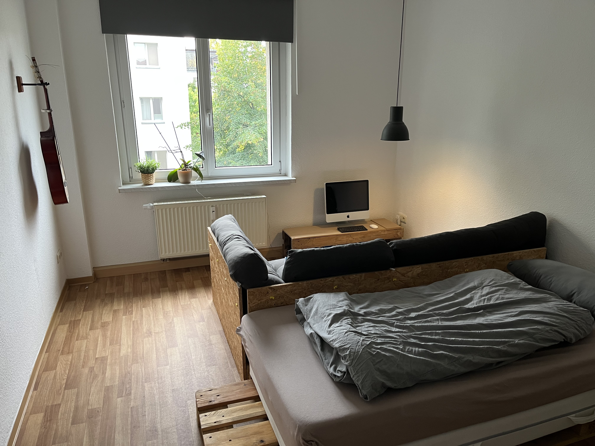          | 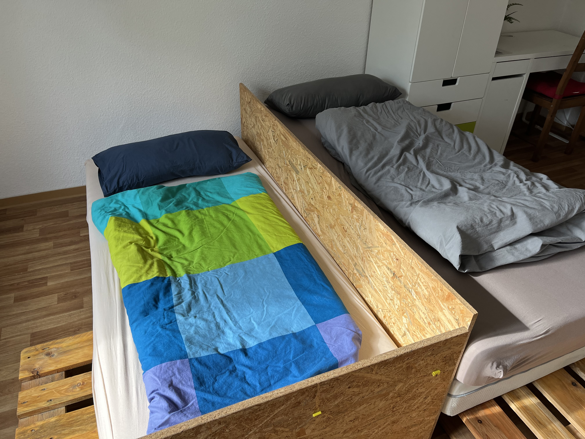   | 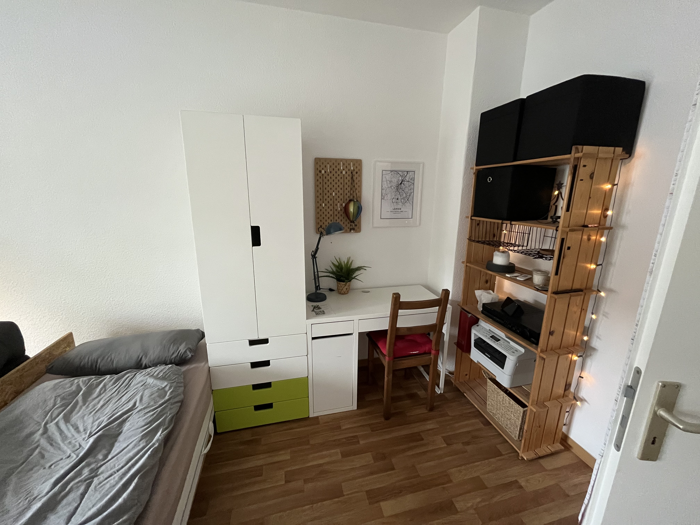 |
| -------------------------------------------------------------------------------------- | ----------------------------------------------------------------------------- | --------------------------------------------------------------------------------------- |
| Configuración de una cama con sofá.                                                    | Configuración de dos camas                                                    | Escritorio                                                                              |
| 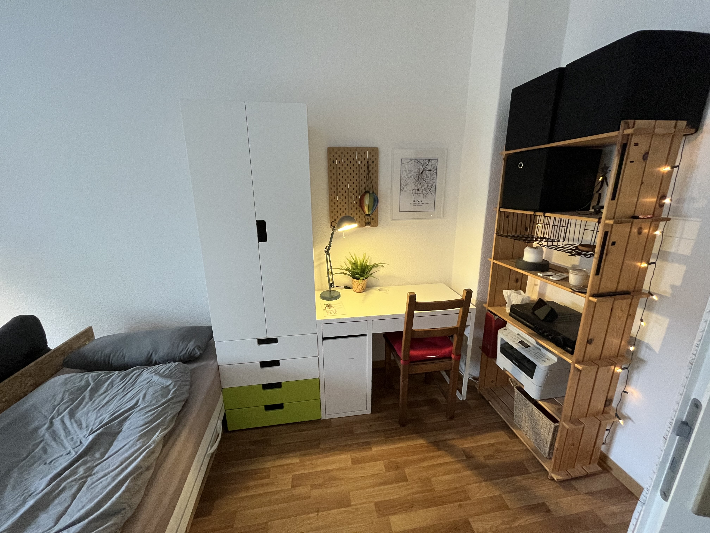 | 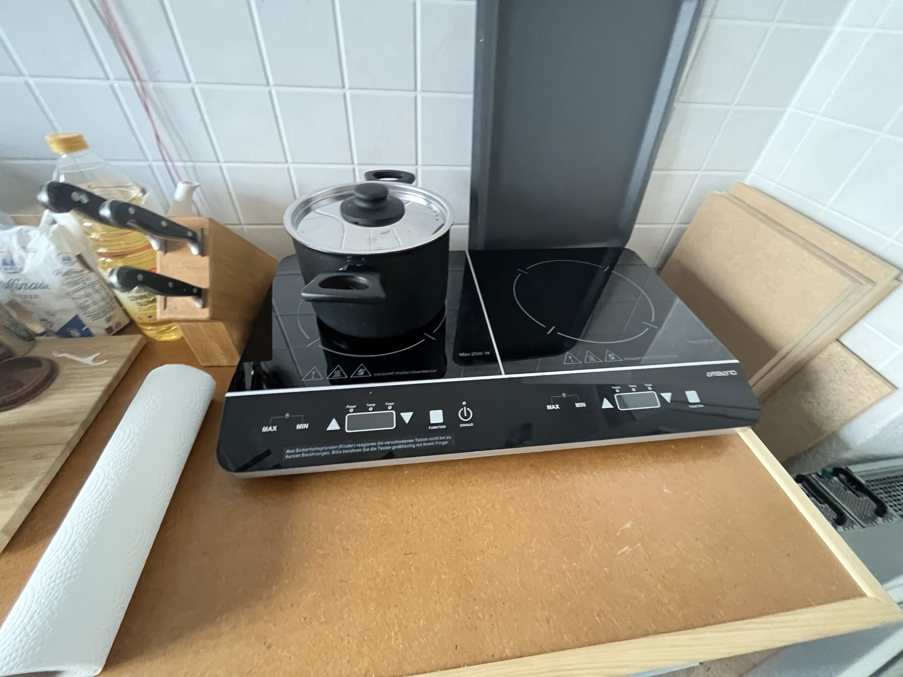           | 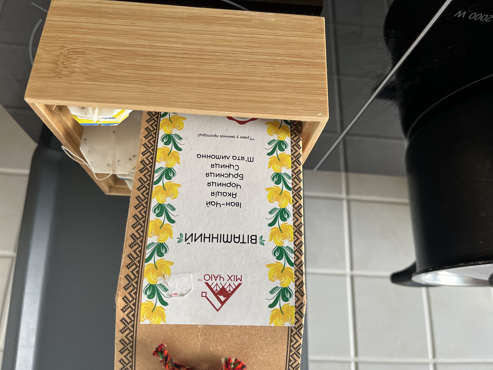                         |
| escritorio con luz                                                                     | Cocina - estufa                                                               | Cocina - té                                                                             |
| 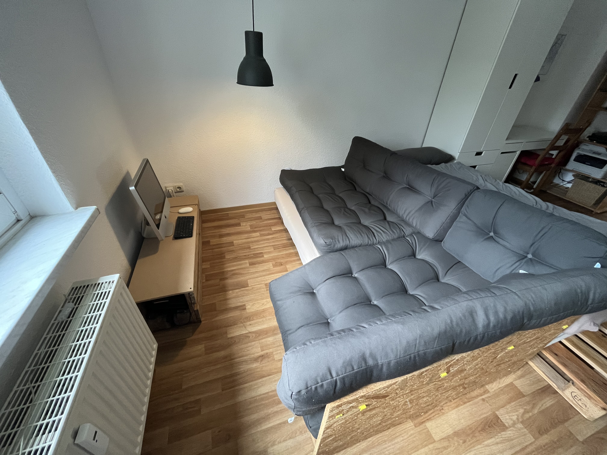           | 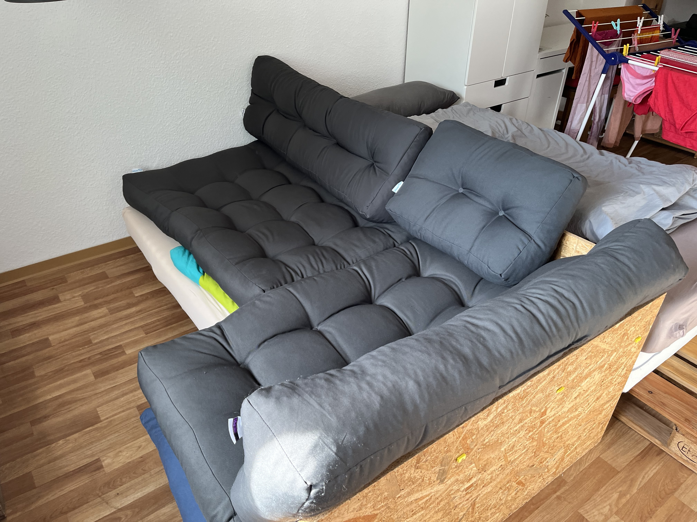 | 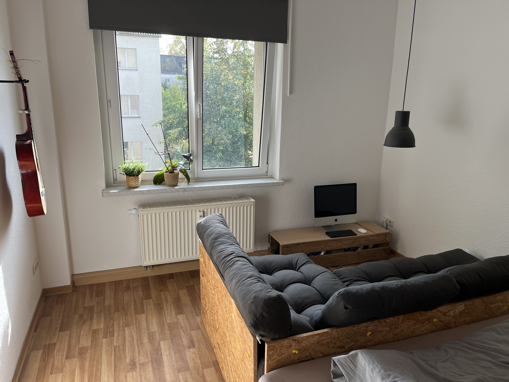           |
| escritorio con luz                                                                     | Cocina - estufa                                                               | Cocina - té                                                                             |

## Llave

Obtienes dos pares de llaves, cada una con una llave para la parte inferior y otra para la parte superior. También hay una llave en un llavero que puedes usar para cerrar tu habitación.

## acceso a Internet

```txt
SSID:     hamburg-bei-nacht
Passwort: landungsbruecken
```

O escaneas este código QR, te conectará automáticamente a la red:

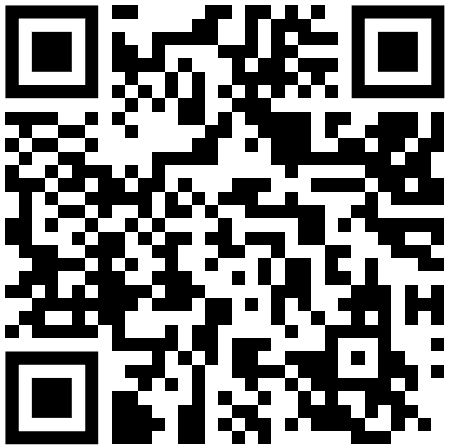

# las habitaciones

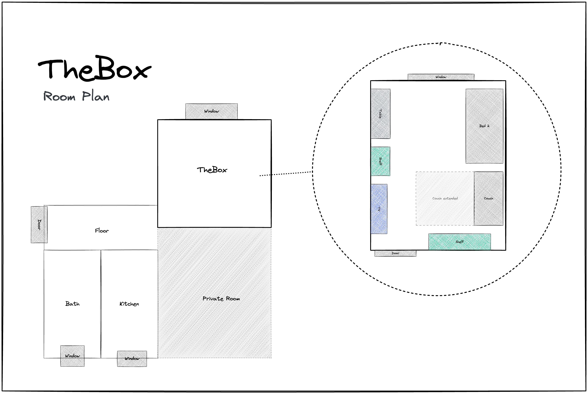

## Cocina

Como suelo comer abajo con mi familia, la cocina es muy espartana. Desafortunadamente, solo se puede lavar en el lavabo del baño. Pero hay un recipiente especial para lavar los platos.

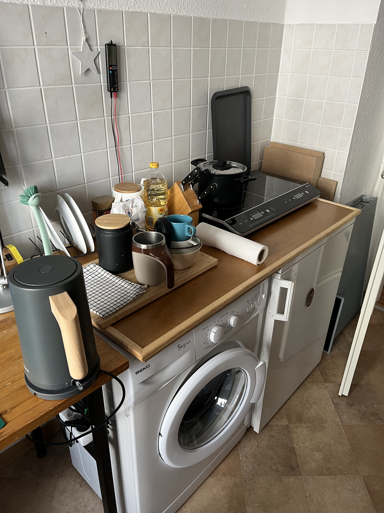

### Las siguientes cosas están disponibles en la cocina.

1.  Rebaño
2.  Pava
3.  platos, cubiertos
4.  Refrigerador
5.  horno para pizzas
6.  agua mineral
7.  Estación de carga de teléfonos móviles en el estante.
8.  lavadora

### Preguntas frecuentes - Cocina

1.  ¿La estufa no funciona? por favor di
    > "Computadora, banco de trabajo y"
2.  ¿Dónde puedo lavarme? Esto sólo funciona en el baño. Hay un recipiente especial para lavar los platos.

## tu habitación

Los colchones se colocan uno encima del otro únicamente con fines de almacenamiento. Puedes distribuirlos según tus necesidades. 
Si reemplazas las almohadas del sofá por un colchón, funcionará bien como cama.

### Los detalles de inicio de sesión para la computadora (iMac) son

```txt
Nutzer:   thebox
Passwort: thebox
```

### Las siguientes cosas están disponibles en la habitación.

1.  Todos los muebles y camas.
2.  Computadoras e impresoras
3.  Mandos a distancia para luces y electricidad.

### Controles remotos

Un viejo dicho alemán se aplica a todos los mandos a distancia: "Intentar es mejor que estudiar". No puedes romper nada. Presione algunos botones y vea qué sucede. Si aún quieres estudiar, aquí tienes la lectura adecuada para ti:

| ilustración                                               | Descripción                                                                                                                                                                                                                                                            |
| --------------------------------------------------------- | ---------------------------------------------------------------------------------------------------------------------------------------------------------------------------------------------------------------------------------------------------------------------- |
| 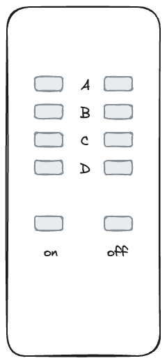  | R: Caja Bluetooth<br>B: luces de hadas<br>C: lámpara de escritorio<br>D:_leer_<br>Maestro: cambia todo al mismo tiempo                                                                                                                                                 |
| 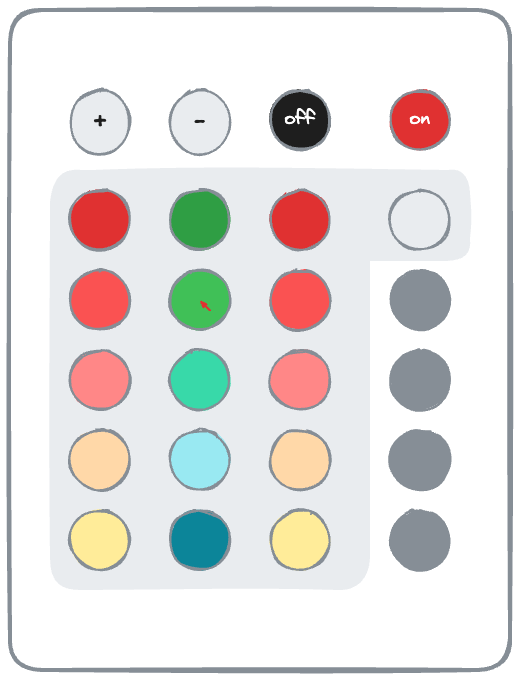 | **Antes de poder usarlo, asegúrese de que el interruptor de la luz en la entrada esté en "encendido".**<br>Primera línea: brillo, encendido/apagado<br>Botones de colores: puedes usarlos para cambiar los colores.<br>Botones grises: cambia entre diferentes efectos |
| 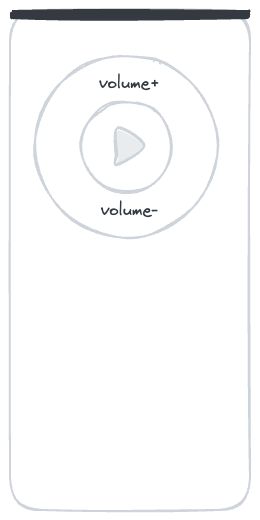    | Este es el control remoto de la computadora (iMac)._Para usar la computadora, presione el botón A en el primer control remoto. Activa la fuente de alimentación del ordenador y de la caja Bluetooth._                                                                 |

### Preguntas frecuentes - Tu habitación

1.  La luz no se enciende o parpadea violentamente. Utilice los pequeños controles remotos con botones de colores.

### baño

Puedes utilizar la ducha estando de pie. No hay problema si el suelo se moja un poco. Abra solo 1/3 del agua y cuelgue la alfombra de baño sobre el calentador para que se seque.

La Alexa en la pared se llama "Computadora" y también reproduce tu música o radio favorita. P.ej. "_Computadora, reproduce Deutschlandfunk Nova_"

Puedes colgar toallas en todos los ganchos y poner tus cosas en cualquier lugar. Hay un estante frente a la puerta del baño. Una parte es tuya.

### Pasillo

Puedes dejar tus zapatos aquí. También tengo un pequeño bloc de notas en el estante por si quieres contarme algo.

# Misceláneas

## Hogar inteligente

Hay asistentes de voz Alexa en el baño y la cocina. Puede dirigirse a ellos con el nombre “Ordenador” y hacer que reproduzcan, por ejemplo, Deutschlandfunk Nova. Entienden alemán y también inglés. Si no quieres usarlos, 
También puedes simplemente desconectarlo de la corriente.

No hay asistentes de voz en tu habitación. La cesta del estante sólo contiene el enrutador y una pequeña computadora.

## temperatura y humedad

La temperatura y la humedad se miden automáticamente a través de los sensores. Los uso para prevenir la formación de moho. Son pequeños y blancos y normalmente se encuentran en los marcos de las puertas. Puedes leer algunos de los datos de medición en el espejo del pasillo.

?> Asegúrese de ventilar regularmente (al menos una vez al día). Especialmente en el baño. Gracias 🙏 La calefacción se apaga automáticamente cuando se abre la ventana.

## El Hofimpchhrlvkdxedgugppagnzmbgsfkrdmjfbkppbahe!A

En nuestro patio podréis conectar vuestras bicicletas y retirar la basura.

\_bocetos/mapa-habitaciones-detalles.png

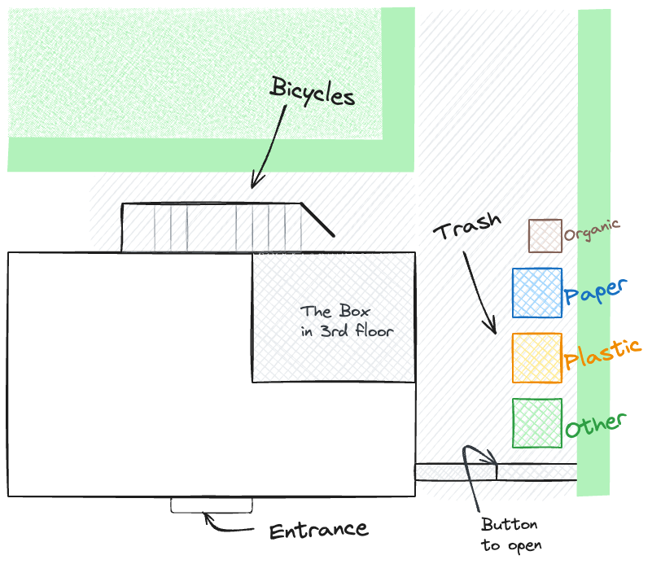

### ¿Cómo se abre la puerta?

O usas la llave de la puerta principal o cruzas la puerta y sientes el botón para abrir la puerta. Mientras mantienes pulsado el botón podrás abrir la puerta.

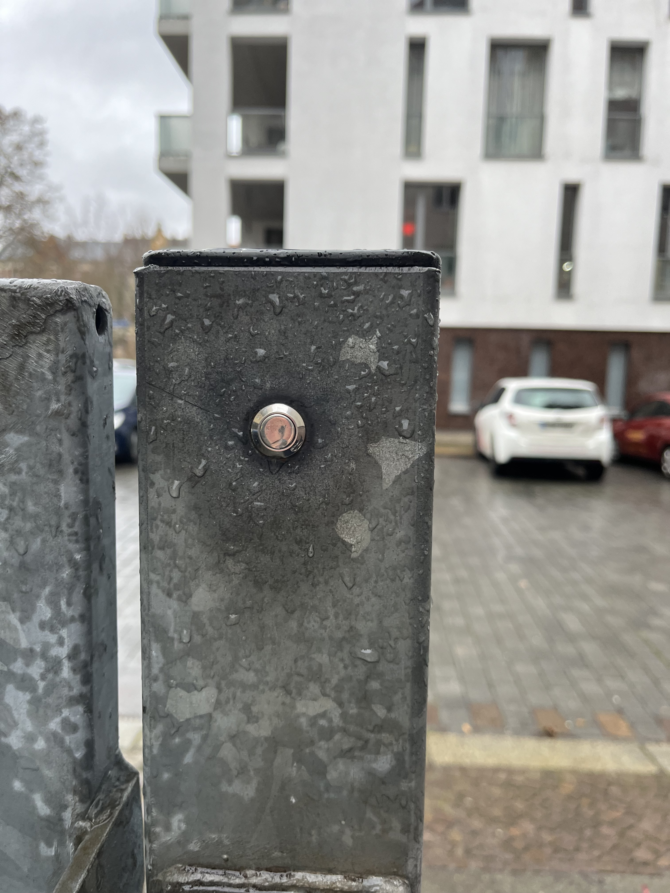

### ¿Amarillo? ¿Azul? ¿Verde? ¿Marrón?

¿Te preguntas por qué los botes de basura tienen diferentes colores? Si no está seguro, coloque siempre la basura en el contenedor verde. Los residuos residuales acaban allí. Los profesionales depositan los residuos de papel en el contenedor azul, los materiales reciclables en el contenedor amarillo y los residuos orgánicos en el contenedor marrón.

### bicicletas

### ¿Mi bicicleta es segura?

Leipzig es una ciudad muy amigable con las bicicletas. A través del gran parque urbano que divide la ciudad en dos mitades, se puede llegar a muchos lugares y normalmente conducir por el campo.
Si nos fijamos en las estadísticas, en Leipzig se roban cada año el mayor número de bicicletas per cápita. (1.539 bicicletas robadas por cada 100.000 habitantes) Desde hace 15 años que vivo aquí en Hardenbergstraße, nunca me han robado una bicicleta y sólo conozco a un vecino a quien le robaron la bicicleta en su patio trasero. Siempre lo conecto directamente a la barandilla.

### ¿Qué alternativas hay?

Con el[Aplicación Leipzig MOVE](https://leipzig-move.de/), obtienes 10 viajes gratis de 15 minutos cada uno para el_Siguientebicicletas_. Tenga en cuenta que cuesta más si no aparca las bicicletas en las calles principales (moradas en el mapa). Los patinetes eléctricos solo se pueden aparcar en determinadas plazas de aparcamiento. También existe un sistema de uso compartido de vehículos free-float. Eso significa con nosotros[ciudadflitzer](https://cityflitzer.de/). Y, por supuesto, hay autobuses y trenes que también puedes pagar a través de la aplicación Leipzig MOVE.

# Verificar

## Llave

-   Dependiendo del día de la semana que sea, podemos despedirnos en persona, o simplemente puedes dejar las llaves en el escritorio y cerrar la puerta detrás de ti.
-   La última hora para realizar el pago es a las 7 p. m. el día de salida.

## limpieza

-   Puedes dejar ropa de cama encima.
-   También lavo los platos y
-   También saco la basura.

> Versión corta: Deja la llave ahí, cierra la puerta y listo. 😀

# estancia más larga

?> Algunos de mis invitados se quedan por un mes o más. Si eres uno de ellos, ¡esta sección es para ti!

## lavadora

Podrás utilizar la lavadora sin tener que preguntar primero. También puedes utilizar el tendedero, detergente en polvo y suavizante. Si quieres ropa de cama nueva, háblame.

## Cepillo de mano y recogedor

En la cocina encontrarás un cepillo de mano y un recogedor en la pared. Esto te ayudará a deshacerte de la pequeña suciedad.

## Limpiar

Puedes encontrar un agente de limpieza verde en una botella con atomizador en el baño para trapear. Junto con el papel de cocina, se puede utilizar para limpiar superficies fácilmente.

## Aspiradora

Tengo un robot aspirador para el suelo.
Antes de que puedas comenzar, retira todo lo que esté en el suelo.
Especialmente cables u otras cosas con las que el robot podría asfixiarse.
Luego colócalo en tu habitación y presiona el botón en la parte superior una vez.
Si no sucede nada, utilice el interruptor de encendido/apagado que se encuentra en el lateral y después
enciéndelo nuevamente usando el botón en la parte superior.

Cuando haya terminado, ¡vuélvalo a colocar en la estación de carga!

# Consejos

Con el[Aplicación Leipzig MOVE](https://leipzig-move.de/), obtienes 10 viajes gratis de 15 minutos cada uno para el_Siguientebicicletas_.
Ten en cuenta que cuesta más si no aparcas el Raf en las calles principales (moradas en el mapa).
Los patinetes eléctricos solo se pueden aparcar en determinadas plazas de aparcamiento.

He almacenado guías de viaje en la aplicación AirBnB. Allí encontrará mis recomendaciones sobre lugares de interés, bares y pubs, tiendas y restaurantes.

# ¿Preguntas?

Si tienes alguna pregunta o necesitas ayuda, estaré encantado de ayudarte.
Si tienes prisa, lo mejor es hacerlo por teléfono. <a href="tel:+491707353067">+49 170 73 53 067</a>.
También puede utilizar la aplicación de mensajería preinstalada con funcionalidad limitada (SMS).
De lo contrario, tengo una libreta y un bolígrafo en el pasillo.

¡Les deseo una agradable estancia en Leipzig!
andré

* * *

_Hecho con ❤️ por [docsificar](https://docsify.js.org/)_
