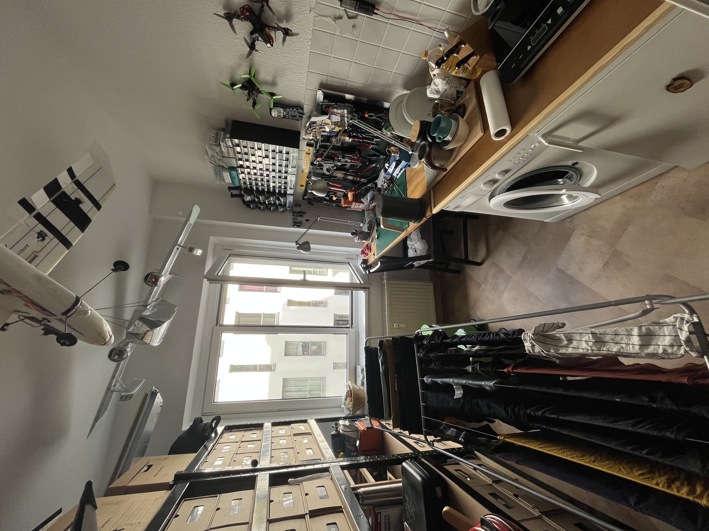
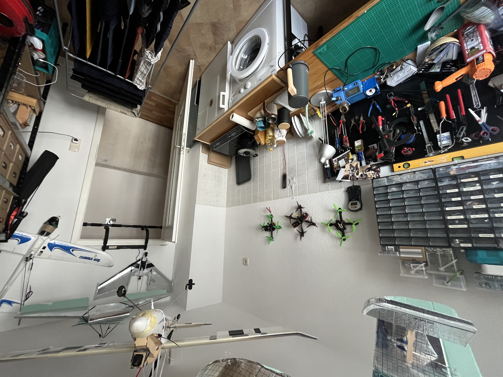
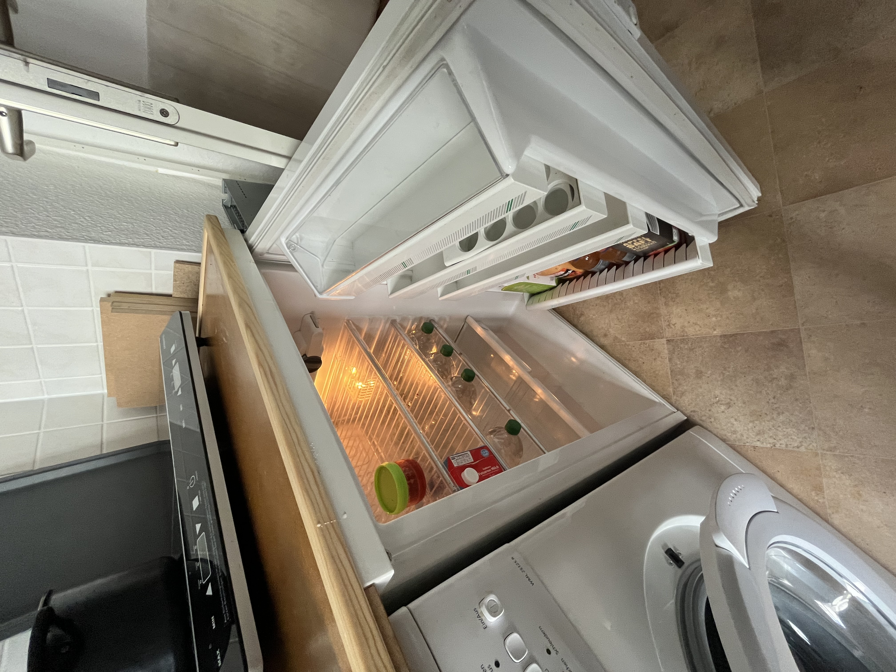

# La boîte

Bonjour et bienvenue dans la « Box » ! Lorsque je voyage, j'aime aussi séjourner dans des AirBnB et parfois j'aimerais avoir un morceau de papier avec toutes les informations nécessaires sur l'hébergement, l'enregistrement et le départ et voici ma tentative pour l'améliorer :


## Enregistrement

### Clé

Vous obtenez deux paires de clés, chacune avec une clé pour le bas et une pour le haut. Il y a aussi une clé sur un porte-clés que vous pouvez utiliser pour verrouiller votre chambre.

### accès Internet

```txt
SSID:     hamburg-bei-nacht
Passwort: landungsbruecken
```

Ou vous scannez ce QR code, il vous connectera automatiquement au réseau :


## Les chambres


### Cuisine

Comme je mange habituellement en bas avec ma famille, la cuisine est très spartiate. Malheureusement, la vaisselle ne peut être faite que dans le lavabo de la salle de bain. Mais il existe un récipient spécial pour faire la vaisselle.

\|

\|


\|

\|

\|

**Les éléments suivants sont à votre disposition :**

1.  Troupeau
2.  Bouilloire
3.  Vaisselle couverts
4.  Réfrigérateur
5.  Pizza de
6.  Eau minérale
7.  Station de recharge de téléphone portable sur l'étagère
8.  Machine à laver

**Le poêle ne fonctionne pas ?**Veuillez dire « Ordinateur, établi allumé »

### Ta chambre

**Les matelas**se trouvent uniquement les uns sur les autres pour le stockage. Vous pouvez les distribuer selon vos besoins. Si vous remplacez les oreillers du canapé par un matelas, cela fait un bon lit.

**L'ordinateur**et le**Drucker**vous êtes invités à l'utiliser.

```txt
Nutzer:   thebox
Passwort: thebox
```

**Les éléments suivants sont à votre disposition :**

1.  Tous les meubles et lits
2.  Ordinateur
3.  Télécommandes pour lumières et électricité

**La lumière ne s'allume pas ou clignote énormément ?**Utilisez les télécommandes.

#### salle de bain

**La douche**vous pouvez l'utiliser debout. Ce n'est pas un problème si le sol est un peu mouillé. Ouvrez seulement 1/3 d'eau et suspendez le tapis de bain au-dessus du radiateur pour le faire sécher.

**Meurs Alexa**sur le mur s'appelle « Ordinateur » et diffuse également votre musique ou votre radio préférée. Par exemple. "_Ordinateur, joue à Deutschlandfunk Nova_"

**les serviettes**Vous pourrez l'accrocher à tous les crochets et ranger vos affaires n'importe où.

#### Couloir

Vous pouvez laisser vos chaussures ici. J'ai aussi un petit bloc-notes sur l'étagère au cas où tu voudrais me dire quelque chose.

## Vérifier

Le**Remise des clés**nous discutons individuellement.**Literie**vous pouvez le laisser. Le**Vaisselle**et le**Ordures**Je le fais aussi.

> **Court:**Laissez la clé là, fermez la porte, c'est tout.

* * *

## Conseils

Avec l'application Leipzig MOVE, vous bénéficiez de 10 trajets gratuits de 15 minutes chacun_Suivantbikes_. A noter que cela coûte plus cher si vous ne garez pas vos vélos dans les rues principales (en violet sur le plan). Les scooters électriques ne peuvent être garés que sur certaines places de stationnement.

## Des questions?

Si vous avez des questions ou avez besoin d'aide, je serai heureux de vous aider. Si vous êtes pressé, il est préférable de le faire par téléphone`+49 170 73 53 067`. Vous pouvez également utiliser l'application de messagerie préinstallée avec des fonctionnalités limitées (SMS). Sinon, j'ai un bloc-notes et un stylo dans le couloir.

Je vous souhaite un bon séjour à Leipzig !
André

* * *

_Réalisé avec ❤️ par[docsifier](https://docsify.js.org/)_
