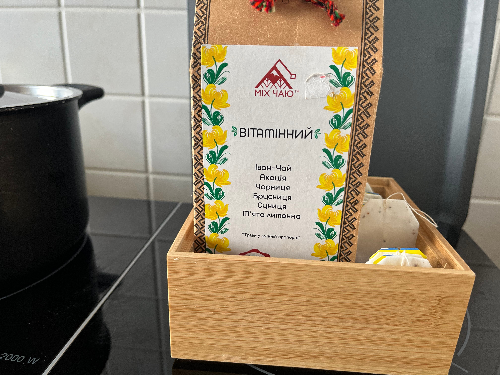

# Benvenuti a La Scatola

Ciao e benvenuto nel “Box”! Quando viaggio, mi piace anche soggiornare negli AirBnB e talvolta vorrei avere un pezzo di carta con tutte le informazioni necessarie sull'alloggio, sul check-in e sul check-out e questo è il mio tentativo di migliorarlo.

> [!Un avviso]Farò tradurre automaticamente il documento nella tua lingua. Spero che sia in qualche modo comprensibile. In caso contrario, sentiti libero di scrivermi un messaggio. Poi provo a migliorarlo.

## Immagini

Sul mio AirBnB hai una panoramica dettagliata di tutte le camere e dei servizi. Ecco solo una breve panoramica:

|           |    |  |
| -------------------------------------------------------------------------------------- | ----------------------------------------------------------------------------- | --------------------------------------------------------------------------------------- |
| Configurazione ad un letto con divano                                                  | Configurazione a due letti                                                    | Scrivania                                                                               |
|  |            |                          |
| Scrivania con luce                                                                     | Cucina - fornello                                                             | Cucina - tè                                                                             |
|            |  |            |
| Scrivania con luce                                                                     | Cucina - fornello                                                             | Cucina - tè                                                                             |

## Chiave

Ottieni due paia di chiavi, ciascuna con una chiave per la parte inferiore e una per la parte superiore. C'è anche una chiave su un portachiavi che puoi usare per chiudere a chiave la tua stanza.

## accesso ad Internet

```txt
SSID:     hamburg-bei-nacht
Passwort: landungsbruecken
```

Oppure scansiona questo codice QR, ti collegherà automaticamente alla rete:


# Le stanze


## Cucina

Dato che di solito mangio al piano di sotto con la mia famiglia, la cucina è molto spartana. Purtroppo è possibile lavare i piatti solo nel lavandino del bagno. Ma c'è un contenitore speciale per i piatti.


### Le seguenti cose sono disponibili in cucina

1.  Gregge
2.  Bollitore
3.  Piatti posate
4.  Frigorifero
5.  Forno per pizze
6.  Acqua minerale
7.  Stazione di ricarica per cellulare sullo scaffale
8.  lavatrice

### Domande frequenti - Cucina

1.  La stufa non funziona? per favore dì
    > "Computer, banco di lavoro e"
2.  Dove posso lavarmi? Funziona solo in bagno. C'è un contenitore speciale per lavare i piatti.

## La vostra stanza

I materassi sono posizionati uno sopra l'altro solo a scopo di stoccaggio. Puoi distribuirli in base alle tue esigenze.
Se sostituisci i cuscini del divano con un materasso, diventa un buon letto.

### I dettagli di accesso per il computer (iMac) sono

```txt
Nutzer:   thebox
Passwort: thebox
```

### Nella stanza sono disponibili le seguenti cose

1.  Tutti i mobili e i letti
2.  Computer e stampanti
3.  Telecomandi per luci ed elettricità

### Controlli remoti

Per tutti i telecomandi vale un vecchio detto tedesco: “Provare è meglio che studiare”. Non puoi rompere nulla. Premi alcuni pulsanti e guarda cosa succede. Se hai ancora voglia di studiare, ecco la lettura giusta per te:

| Illustrazione                                             | Descrizione                                                                                                                                                                                                                                              |
| --------------------------------------------------------- | -------------------------------------------------------------------------------------------------------------------------------------------------------------------------------------------------------------------------------------------------------- |
|   | R: Scatola Bluetooth<br>B: Lucine<br>C: Lampada da scrivania<br>D:_file_<br>Maestro: Cambia tutto allo stesso tempo                                                                                                                                      |
|  | **Prima di poterlo utilizzare, assicurati che l'interruttore della luce all'ingresso sia impostato su "on".**<br>Prima riga: luminosità, on/off<br>Pulsanti colorati: puoi usarli per cambiare i colori<br>Pulsanti grigi: passa da un effetto all'altro |
|     | Questo è il telecomando del computer (iMac)._Per utilizzare il computer, premere il pulsante A sul primo telecomando. Attiva l'alimentazione del computer e del box Bluetooth._                                                                          |

### FAQ - La tua camera

1.  La luce non si accende o lampeggia all'impazzata, usa i piccoli telecomandi con i tasti colorati.

### bagno

Puoi usare la doccia stando in piedi. Non è un problema se il terreno si bagna un po'. Apri l'acqua solo a 1/3 e appendi il tappetino da bagno sopra il riscaldamento per asciugarlo.

L'Alexa sul muro si chiama "Computer" e riproduce anche la tua musica o radio preferita. Per esempio. "_Computer, riproduci Deutschlandfunk Nova_"

Puoi appendere gli asciugamani a tutti i ganci e riporre le tue cose ovunque. C'è uno scaffale davanti alla porta del bagno. Un pezzo è tuo.

### Corridoio

Puoi lasciare le tue scarpe qui. Ho anche un piccolo blocco note sullo scaffale nel caso volessi dirmi qualcosa.

# Varie

## Casa intelligente

Sono presenti gli assistenti vocali Alexa in bagno e in cucina. Puoi chiamarli "Computer" e farli giocare, ad esempio, a Deutschlandfunk Nova. Capiscono il tedesco e anche l'inglese. Se non vuoi usarli,
Puoi anche semplicemente scollegarlo dalla corrente.

Non ci sono assistenti vocali nella tua stanza. Il cestino sullo scaffale contiene solo il router e un piccolo computer.

## temperatura e umidità

La temperatura e l'umidità vengono misurate automaticamente tramite i sensori. Li uso per prevenire la formazione di muffe. Sono piccoli e bianchi e di solito si trovano sugli stipiti delle porte. Puoi leggere alcuni dati di misurazione nello specchio nel corridoio.

?> Assicurati di ventilare regolarmente (almeno una volta al giorno). Soprattutto in bagno. Assicurati anche che il riscaldamento sia spento. Grazie 🙏

## Il cortile

Nel nostro cortile puoi collegare le tue biciclette e portare via la tua spazzatura.


### Come si apre il cancello?

O usi la chiave della porta d'ingresso, oppure raggiungi il cancello e senti il ​​pulsante per aprire la porta. Mentre tieni premuto il pulsante puoi aprire la porta.


### Giallo? Blu? Verde? Marrone?

Ti stai chiedendo perché i bidoni della spazzatura hanno colori diversi? Se non sei sicuro, getta sempre la spazzatura nel cestino verde. I rifiuti residui finiscono lì. I professionisti mettono la carta nel contenitore blu, i materiali riciclabili nel contenitore giallo e i rifiuti organici nel contenitore marrone.

### Cicli

### La mia bici è sicura?

Lipsia è una città molto bike-friendly. Attraverso il grande parco cittadino che divide la città in due metà, si possono raggiungere molti luoghi e solitamente si attraversa la campagna.
Secondo le statistiche, ogni anno a Lipsia viene rubata la maggior parte delle biciclette pro capite. (1.539 biciclette rubate ogni 100.000 abitanti) Da quando abito qui in Hardenbergstraße, da 15 anni, non mi è mai stata rubata una bicicletta e conosco solo un vicino la cui bicicletta è stata rubata dal suo cortile. Lo collego sempre direttamente alla ringhiera.

### Quali alternative ci sono?

Con il[App MOVE di Lipsia](https://leipzig-move.de/), ricevi 10 corse gratuite da 15 minuti ciascuna per il_Nextbikes_. Tieni presente che costa di più se non parcheggi le bici nelle strade principali (viola sulla mappa). Gli e-scooter possono essere parcheggiati solo in determinati parcheggi. Esiste anche un sistema di car sharing a flusso libero. Ciò significa con noi[cityflitzer](https://cityflitzer.de/). E naturalmente ci sono autobus e treni che potete pagare anche tramite l'app Leipzig MOVE.

# Guardare

## Chiave

-   A seconda del giorno della settimana possiamo salutarvi di persona oppure potete semplicemente lasciare le chiavi sulla scrivania e chiudervi la porta alle spalle.
-   L'ultimo orario per il check-out è alle 19:00 del giorno di partenza.

## pulizia

-   Puoi lasciare la biancheria da letto sopra.
-   Lavo anche i piatti e
-   Porto fuori anche la spazzatura.

> Versione breve: lascia lì la chiave, chiudi la porta, tutto qui. 😀

# Soggiorno più lungo

?> Alcuni dei miei ospiti rimangono per un mese o più. Se sei uno di loro, allora questa sezione è per te!

## lavatrice

È possibile utilizzare la lavatrice senza dover chiedere prima. È possibile utilizzare anche lo stendino, il detersivo e l'ammorbidente. Se desideri una nuova biancheria da letto, parlami.

## Spazzola a mano e paletta

In cucina troverete una spazzola a mano e una paletta appesa al muro. Questo ti aiuterà a sbarazzarti del piccolo sporco.

## Pulire

Puoi trovare un detergente verde in un flacone spray in bagno per pulire. Insieme alla carta da cucina può essere utilizzata per pulire facilmente le superfici.

## Aspirapolvere

Ho un robot aspirapolvere per pavimenti.
Prima di iniziare, togli tutto dal pavimento.
Soprattutto cavi o altri oggetti con cui il robot potrebbe soffocare.
Quindi mettilo nella tua stanza e premi una volta il pulsante in alto.
Se non succede nulla, utilizzare l'interruttore on/off sul lato e successivamente
riaccenderlo utilizzando il pulsante in alto.

Una volta terminato, rimettilo nella stazione di ricarica!

# Suggerimenti

Con il[App MOVE di Lipsia](https://leipzig-move.de/), ricevi 10 corse gratuite da 15 minuti ciascuna per il_Nextbikes_.
Tieni presente che costa di più se non parcheggi il Raf nelle strade principali (viola sulla mappa).
Gli e-scooter possono essere parcheggiati solo in determinati parcheggi.

Ho memorizzato le guide di viaggio nell'app AirBnB. Lì troverai i miei consigli su attrazioni, bar e pub, opportunità di shopping e ristoranti.

# Domande?

Se hai domande o hai bisogno di supporto, sarò felice di aiutarti.
Se avete fretta è meglio farlo telefonicamente <a href="tel:+491707353067">+49 170 73 53 067</a>.
Puoi anche utilizzare l'app di messaggistica preinstallata con funzionalità limitate (SMS).
Altrimenti ho un blocco note e una penna nel corridoio.

Ti auguro un bel soggiorno a Lipsia!
André

* * *

_Realizzato con ❤️ da [documentare](https://docsify.js.org/)_
