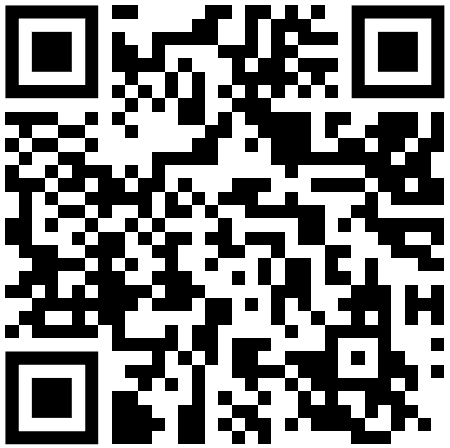
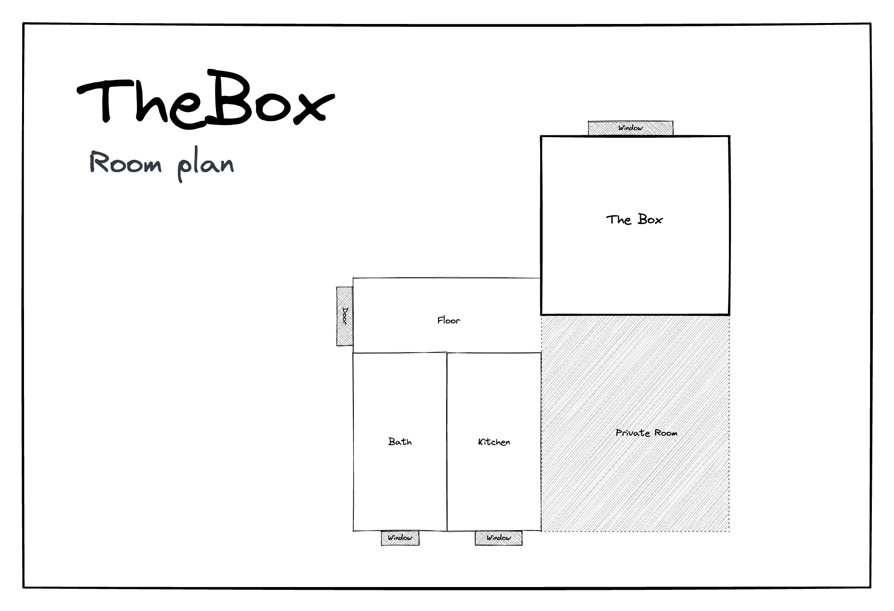
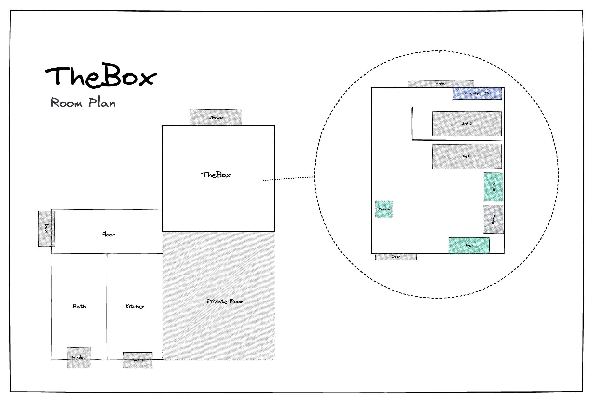

# ボックス

こんにちは、「ボックス」へようこそ！私も旅行するときは AirBnB に泊まるのが好きですが、宿泊施設、チェックイン、チェックアウトに関する必要な情報がすべて記載された紙があればいいのにと思うことがあります。これはそれを改善するための私の試みです。

## チェックイン

### 鍵

キーは 2 組あり、それぞれに下部に 1 つと上部に 1 つのキーがあります。キーチェーンには鍵も付いており、部屋の施錠に使用できます。

### インターネット・アクセス

```txt
SSID:     hamburg-bei-nacht
Passwort: landungsbruecken
```

または、この QR コードをスキャンすると、自動的にネットワークに接続されます。

｜

## 部屋



### 詳細図



### 台所

普段家族と一緒に下の階で食事をしているので、キッチンはとてもスパルタンです。残念ながら、洗い物はバスルームのシンクでのみ可能です。

**次のものが利用可能です。**

1.  群れ
2.  ケトル
3.  食器カトラリー
4.  冷蔵庫
5.  ピザオブ
6.  ミネラルウォーター
7.  棚にある携帯電話の充電ステーション
8.  洗濯機

**ストーブが作動していませんか?**言ってください：

> 「コンピューター、作業台、そして」

#### あなたの部屋

**マットレス**保管のみを目的としています

* * *

_❤️で作りました[文書化する](https://docsify.js.org/)_
