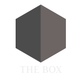

# ボックス

こんにちは、「ボックス」へようこそ！私も旅行するときは AirBnB に泊まるのが好きですが、宿泊施設、チェックイン、チェックアウトに関する必要な情報がすべて記載された紙があればいいのにと思うことがあります。これはそれを改善するための私の試みです。



## チェックイン

### 鍵

キーは 2 組あり、それぞれに下部に 1 つと上部に 1 つのキーがあります。キーチェーンには鍵も付いており、部屋の施錠に使用できます。

### インターネット・アクセス

```txt
SSID:     hamburg-bei-nacht
Passwort: landungsbruecken
```

または、この QR コードをスキャンすると、自動的にネットワークに接続されます。


## 部屋


### 台所

普段家族と一緒に下の階で食事をしているので、キッチンはとてもスパルタンです。残念ながら、洗い物はバスルームのシンクでのみ可能です。ただし、食器を洗うための専用の容器があります。


**次のものが利用可能です。**

1.  群れ
2.  ケトル
3.  食器カトラリー
4.  冷蔵庫
5.  ピザオブ
6.  ミネラルウォーター
7.  棚にある携帯電話の充電ステーション
8.  洗濯機

**ストーブが作動していませんか?**「コンピューター、ワークベンチをオンにしてください」と言ってください。

### あなたの部屋

**マットレス**保管する場合は重ねて置くだけです。ニーズに応じて配布できます。ソファの枕をマットレスに置き換えれば、立派なベッドになります。

**コンピュータ**そしてその**ドラッカー**ぜひご利用ください。

```txt
Nutzer:   thebox
Passwort: thebox
```

**次のものが利用可能です。**

1.  すべての家具とベッド
2.  コンピューター
3.  照明や電気のリモコン

**ライトが点灯しない、または激しく点滅しますか?**リモコンを使用します。

#### バスルーム

**にわか雨**立ったまま使用できます。多少地面が濡れても問題ありません。水を1/3にして、バスマットをヒーターの上に掛けて乾燥させます。

**ダイ・アレクサ**壁にある「コンピューター」は、お気に入りの音楽やラジオを再生することもできます。例：「_コンピューター、Deutschlandfunk Nova をプレイしてください_”

**タオル**すべてのフックに掛けて、どこにでも物を置くことができます。

#### 廊下

靴をここに預けていただいても結構です。何か言いたいことがある場合に備えて、棚の上に小さなメモ帳もあります。

## チェックアウト

の**キーの引き継ぎ**個別に話し合います。**寝具**そのままにしておくことができます。の**洗い物**そしてその**ごみ**私もそうします。

> **短い：**鍵をそこに置いて、ドアを閉めて、それだけです。

* * *

## チップ

Leipzig MOVE アプリを使用すると、1 回につき 15 分間の乗車を 10 回無料で利用できます_ネクストバイク_。自転車を大通り（地図上の紫色）に駐車しない場合は、料金が高くなることに注意してください。電動スクーターは、特定の駐車スペースにのみ駐車できます。

## 質問がありますか?

ご質問がある場合やサポートが必要な場合は、喜んでお手伝いさせていただきます。お急ぎの場合はお電話がおすすめです<a href="tel:+491707353067">＋４９ １７０ ７３ ５３ ０６７</a>。機能が制限されたプリインストールされたメッセンジャー アプリ (SMS) を使用することもできます。それ以外の場合は、廊下にメモ帳とペンがあります。

ライプツィヒでの素敵なご滞在をお祈りしております。
アンドレ

* * *

_❤️で作りました[文書化する](https://docsify.js.org/)_
