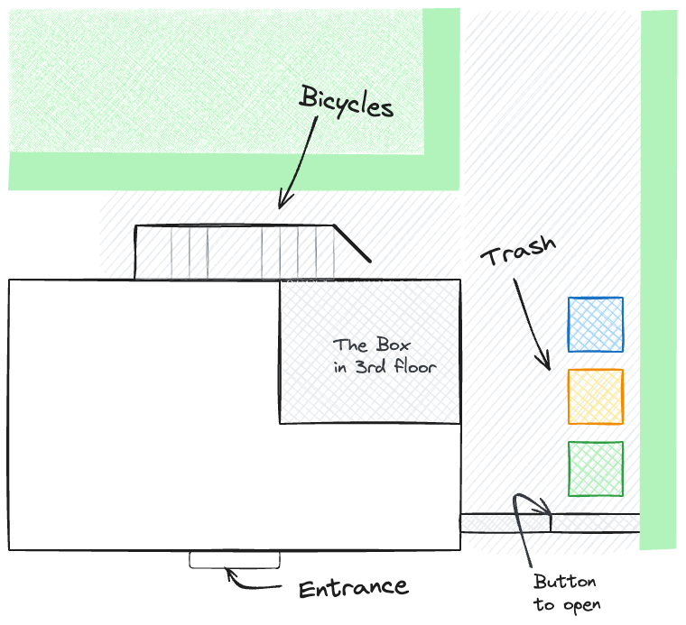

# いらっしゃいませ

こんにちは、「ボックス」へようこそ！私も旅行するときは AirBnB に泊まるのが好きですが、宿泊施設、チェックイン、チェックアウトに関する必要な情報がすべて記載された紙があればいいのにと思うことがあります。これはそれを改善するための私の試みです。

> [！注意!]文書をあなたの言語に自動的に翻訳します。ある程度は理解できると思います。そうでない場合は、お気軽にメッセージを書いてください。それからそれを改善しようとします。

## ピクチャー

私のAirBnBでは、すべての部屋と設備の詳細な概要をご覧いただけます。以下に簡単な概要を示します。

|           |    |  |
| -------------------------------------------------------------------------------------- | ----------------------------------------------------------------------------- | --------------------------------------------------------------------------------------- |
| ベッド 1 台とソファの構成                                                                         | 2ベッド構成                                                                        | 机                                                                                       |
|  |            |                          |
| ライト付きデスク                                                                               | キッチン - コンロ                                                                    | キッチン - お茶                                                                               |
|            |  |            |
| ライト付きデスク                                                                               | キッチン - コンロ                                                                    | キッチン - お茶                                                                               |

## 鍵

キーは 2 組あり、それぞれに下部に 1 つと上部に 1 つのキーがあります。キーチェーンには鍵も付いており、部屋の施錠に使用できます。

## インターネット・アクセス

```txt
SSID:     hamburg-bei-nacht
Passwort: landungsbruecken
```

または、この QR コードをスキャンすると、自動的にネットワークに接続されます。


# 部屋


## 台所

普段家族と一緒に下の階で食事をしているので、キッチンはとてもスパルタンです。残念ながら、洗い物はバスルームのシンクでのみ可能です。ただし、食器を洗うための専用の容器があります。


### キッチンには以下のものをご用意しております

1.  群れ
2.  ケトル
3.  食器カトラリー
4.  冷蔵庫
5.  ピザ窯
6.  ミネラルウォーター
7.  棚にある携帯電話の充電ステーション
8.  洗濯機

### FAQ - キッチン

1.  ストーブが作動していませんか?言ってください
    > 「コンピューター、作業台、そして」
2.  どこで洗えますか？これはバスルームでのみ機能します。食器を洗うための専用の容器があります。

## あなたの部屋

マットレスは保管目的でのみ重ねて置かれます。ニーズに応じて配布できます。
ソファの枕をマットレスに変えればベッドとしても使えます。

### Die Zugangsdaten für den Computer (iMac) sind

```txt
Nutzer:   thebox
Passwort: thebox
```

### 室内には以下のものをご用意しております

1.  すべての家具とベッド
2.  コンピューターとプリンター
3.  照明や電気のリモコン

### リモコン

ドイツの古いことわざは、「勉強するよりも試したほうが良い」という言葉で、すべてのリモコンに当てはまります。何も壊すことはできません。いくつかのボタンを押して、何が起こるかを見てください。それでも勉強したい場合は、次の本を読んでください。

| 図                                                         | 説明                                                                                                            |
| --------------------------------------------------------- | ------------------------------------------------------------------------------------------------------------- |
|   | A：Bluetoothボックス<br>B: フェアリーライト<br>C: 電気スタンド<br>D:_ファイル_<br>マスター：すべてを同時に切り替えてください                              |
|  | **ご使用前に玄関の照明スイッチが「入」になっていることをご確認ください。**<br>1行目：明るさ、オン/オフ<br>色付きボタン: これを使用して色を変更できます<br>灰色のボタン: さまざまな効果を切り替えます |
|     | パソコン（iMac）のリモコンです。_コンピューターを使用するには、最初のリモコンの A ボタンを押します。コンピューターと Bluetooth ボックスの電源を有効にします。_                     |

### FAQ - お部屋について

1.  ライトが点灯したり激しく点滅したりしません。カラフルなボタンが付いた小さなリモコンを使用してください。

### バスルーム

立ったままシャワーが使えます。多少地面が濡れても問題ありません。水を1/3にして、バスマットをヒーターの上に掛けて乾燥させます。

壁にある Alexa は「コンピューター」という名前で、お気に入りの音楽やラジオも再生します。例：「_コンピューター、Deutschlandfunk Nova をプレイしてください_”

すべてのフックにタオルを掛けて、どこにでも物を置くことができます。

### 廊下

靴をここに預けていただいても結構です。何か言いたいことがある場合に備えて、棚の上に小さなメモ帳もあります。

# その他

## スマートホーム

アパートメントにはAlexa音声アシスタントが設置されています。たとえば、「コンピューター」という名前で彼らに呼びかけ、Deutschlandfunk Nova をプレイさせることができます。デバイスはインターネットに接続されており、目覚まし時計やタイマーとしても使用できます。使用したくない場合は、電源からプラグを抜くだけで済みます。

あなたの部屋には音声アシスタントはありません。棚の上のカゴにはルーターと小型コンピューターしか入っていません。

## 温度と湿度

温度と湿度はセンサーによって自動的に測定されます。カビの発生を防ぐために使っています。それらは小さくて白く、通常はドア枠の上にあります。測定データの一部は廊下の鏡で閲覧できます。

?>定期的(1日1回以上)に換気を行ってください。特にバスルームで。また、暖房が切れていることを確認してください。ありがとうございます🙏

## 庭

中庭では自転車を連結してゴミを持ち帰ることができます。



### 門はどうやって開くの？

玄関の鍵を使うか、門を通ってボタンを押してドアを開けるかのどちらかです。ボタンを押している間、ドアを開けることができます。


### 黄色？青？緑？茶色？

なぜゴミ箱の色が違うのか気になりますか？よくわからない場合は、ゴミは必ず緑色のゴミ箱に入れてください。残留廃棄物は最終的にそこに行きます。専門家は、紙くずを青い箱に、リサイクル可能なものを黄色の箱に、有機性廃棄物を茶色の箱に入れます。

### サイクル

### 私の自転車は安全ですか?

ライプツィヒは自転車にとても優しい街です。街を 2 つに分ける大きな都市公園を通って、さまざまな場所に行くことができ、通常は田園地帯を車で通り抜けます。
この統計を信じるのであれば、毎年ライプツィヒで一人当たり最も多くの自転車が盗まれていることになります。 (住民 100,000 人あたり 1,539 台の自転車が盗まれています) 私はここハルデンベルク通りに住んでから 15 年間、一度も自転車を盗まれたことがありません。裏庭で自転車が盗まれた隣人を 1 人だけ知っています。いつも手すりに直接接続してます。

### どのような代替案があるでしょうか?

とともに[ライプツィヒ MOVE アプリ](https://leipzig-move.de/)、各 15 分間の乗車が 10 回無料になります。_ネクストバイク_。自転車を大通り（地図上の紫色）に駐車しない場合は、料金が高くなることに注意してください。電動スクーターは、特定の駐車スペースにのみ駐車できます。フリーフロートカーシェアリングシステムもあります。つまり、私たちと一緒に[シティフリッツァー](https://cityflitzer.de/)。もちろん、Leipzig MOVE アプリ経由で支払い可能なバスや電車もあります。

# チェックアウト

## 鍵

-   曜日に応じて、直接お別れを言うこともできますし、鍵を机の上に置いて後ろ手にドアを閉めることもできます。
-   最終チェックアウト時間はご出発日の午後 7 時です。

## クリーニング

-   寝具を置いたままにできます。
-   食器も洗ってますし、
-   ゴミも出します。

> 短いバージョン: 鍵をそこに置いて、ドアを閉めて、それだけです。 😀

# 長期滞在

?> 私のゲストの中には 1 か月以上滞在する人もいます。あなたもその一人であれば、このセクションはあなたのためのものです!

## 洗濯機

事前に連絡しなくても洗濯機を使用できます。乾燥ラック、洗剤、柔軟剤も使用できます。新しいベッドリネンが必要な場合は、私に話しかけてください。

## ハンドブラシとちりとり

キッチンにはハンドブラシとちりとりが壁に設置されています。こうすることで細かい汚れを取り除くことができます。

## ワイプ

バスルームのモップ掛け用のスプレーボトルに入った緑色の洗浄剤を見つけることができます。キッチンペーパーと併用すると簡単に汚れを落とすことができます。

## 掃除機

床用のロボット掃除機を持っています。
始める前に、床の上のものを邪魔にならないように片付けてください。特に、ロボットが窒息する可能性のあるコードやその他のもの。それから部屋に置き、上部のボタンを1回押します。何も起こらない場合は、側面のオン/オフスイッチを使用してください。

使い終わったら、充電ステーションに戻してください。

# チップ

とともに[ライプツィヒ MOVE アプリ](https://leipzig-move.de/)、各 15 分間の乗車が 10 回無料になります。_ネクストバイク_。自転車を大通り（地図上の紫色）に駐車しない場合は、料金が高くなることに注意してください。電動スクーターは、特定の駐車スペースにのみ駐車できます。

旅行ガイドを AirBnB アプリに保存しました。そこでは、私のおすすめの観光スポット、バーやパブ、ショッピングスポット、レストランが見つかります。

# 質問がありますか?

ご質問がある場合やサポートが必要な場合は、喜んでお手伝いさせていただきます。お急ぎの場合はお電話がおすすめです <a href="tel:+491707353067">＋４９ １７０ ７３ ５３ ０６７</a>。機能が制限されたプリインストールされたメッセンジャー アプリ (SMS) を使用することもできます。それ以外の場合は、廊下にメモ帳とペンがあります。

ライプツィヒでの素敵なご滞在をお祈りしております。
アンドレ

* * *

_❤️で作りました [文書化する](https://docsify.js.org/)_
