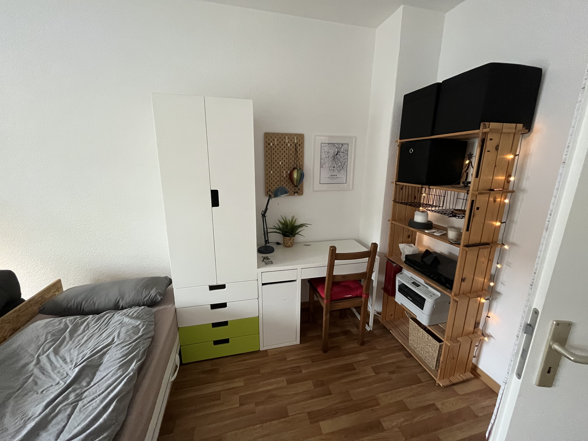

# 더박스에 오신 것을 환영합니다

안녕하세요, “Box”에 오신 것을 환영합니다! 여행할 때 에어비앤비에 머무르는 것도 좋아하는데 때로는 숙소, 체크인, 체크아웃에 대해 필요한 모든 정보가 적힌 종이가 있었으면 좋겠는데 이것이 더 나은 서비스를 제공하려는 시도입니다.

> [!Hinweis]해당 문서를 귀하의 언어로 자동 번역해 드리겠습니다. 어느 정도 이해가 되셨으면 좋겠습니다. 그렇지 않은 경우에는 나에게 메시지를 보내 주시기 바랍니다. 그런 다음 개선하려고 노력합니다.

## 영화

내 에어비앤비에서는 모든 객실과 시설에 대한 자세한 개요를 볼 수 있습니다. 다음은 간략한 개요입니다.

|           |    |  |
| -------------------------------------------------------------------------------------- | ----------------------------------------------------------------------------- | --------------------------------------------------------------------------------------- |
| 소파가 포함된 침대 1개 구성                                                                       | 2베드 구성                                                                        | 책상                                                                                      |
|  |            |                          |
| 조명이 있는 책상                                                                              | 주방 - 스토브                                                                      | 주방 - 차                                                                                  |
|            |  |            |
| 조명이 있는 책상                                                                              | 주방 - 스토브                                                                      | 주방 - 차                                                                                  |

## 열쇠

두 쌍의 키가 제공되며 각 키에는 하단에 하나, 상단에 하나가 있습니다. 열쇠고리에는 방을 잠그는 데 사용할 수 있는 열쇠도 있습니다.

## 인터넷 액세스

```txt
SSID:     hamburg-bei-nacht
Passwort: landungsbruecken
```

또는 이 QR 코드를 스캔하면 자동으로 네트워크에 연결됩니다.


# 객실


## 주방

저는 주로 아래층에서 가족들과 함께 식사를 하기 때문에 주방이 매우 깔끔합니다. 아쉽게도 설거지는 화장실 세면대에서만 가능합니다. 하지만 설거지를 위한 특별한 용기가 있습니다.


### 주방에는 다음과 같은 것들이 준비되어 있습니다

1.  떼
2.  주전자
3.  식기류
4.  냉장고
5.  피자 오븐
6.  광천수
7.  선반에 휴대폰 충전 스테이션
8.  세탁기

### FAQ - 주방

1.  스토브가 작동하지 않나요? 말해주세요
    > "컴퓨터, 작업대"
2.  어디서 씻을 수 있나요? 이것은 화장실에서만 작동합니다. 설거지용 특수 용기가 있습니다.

## 너의 방

매트리스는 보관 목적으로만 서로 겹쳐서 배치됩니다. 필요에 따라 배포할 수 있습니다.
소파 쿠션을 매트리스로 교체하면 좋은 침대가 됩니다.

### 컴퓨터(iMac)의 로그인 세부정보는 다음과 같습니다.

```txt
Nutzer:   thebox
Passwort: thebox
```

### 객실 내에서 다음과 같은 물품을 이용하실 수 있습니다.

1.  모든 가구와 침대
2.  컴퓨터 및 프린터
3.  조명 및 전기 원격 제어

### 리모콘

독일의 속담은 모든 리모콘에 적용됩니다. "노력하는 것이 공부하는 것보다 낫다." 당신은 아무것도 깨뜨릴 수 없습니다. 몇 개의 버튼을 누르고 무슨 일이 일어나는지 확인하십시오. 아직도 공부하고 싶다면 다음과 같은 책을 읽어보세요.

| 삽화                                                        | 설명                                                                                                                           |
| --------------------------------------------------------- | ---------------------------------------------------------------------------------------------------------------------------- |
|   | 답: 블루투스박스<br>B: 요정 조명<br>C: 책상 램프<br>디:_파일_<br>마스터: 모든 것을 동시에 전환하세요                                                          |
|  | **사용 전, 입구의 전등 스위치가 '켜짐'으로 설정되어 있는지 확인하세요.**<br>첫 번째 줄: 밝기, 켜기/끄기<br>컬러 버튼: 이 버튼을 사용하여 색상을 변경할 수 있습니다.<br>회색 버튼: 다양한 효과 간 전환 |
|     | 컴퓨터(iMac)용 리모컨입니다._컴퓨터를 사용하려면 첫 번째 리모콘의 A 버튼을 누르세요. 컴퓨터와 Bluetooth 상자의 전원 공급 장치를 활성화합니다._                                    |

### FAQ - 객실

1.  불이 들어오지 않거나 심하게 깜박입니다. 다채로운 버튼이 있는 작은 리모콘을 사용하세요.

### 화장실

서서 샤워를 할 수 있습니다. 땅이 조금 젖어도 문제가 되지 않습니다. 물의 양을 1/3만 맞추고 욕실매트를 히터 위에 걸어 건조시켜주세요.

벽에 걸린 Alexa는 "컴퓨터"라는 이름으로 불리며 좋아하는 음악이나 라디오도 재생합니다. 예: "_컴퓨터, Deutschlandfunk Nova 플레이_"

모든 후크에 수건을 걸고 물건을 어디에나 놓을 수 있습니다. 욕실 문 앞에 선반이 있습니다. 그 중 하나는 당신 것입니다.

### 현관

이곳에 신발을 맡겨두시면 됩니다. 나에게 하고 싶은 말이 있을 경우를 대비해 선반 위에 작은 메모장도 있어요.

# 여러 가지 잡다한

## 똑똑한 집

욕실과 주방에는 Alexa 음성 비서가 있습니다. 예를 들어 "컴퓨터"라는 이름으로 주소를 지정하고 Deutschlandfunk Nova를 재생하도록 할 수 있습니다. 그들은 독일어와 영어도 이해합니다. 사용하고 싶지 않다면,
간단히 전원을 분리할 수도 있습니다.

객실에는 음성 도우미가 없습니다. 선반 위의 바구니에는 라우터와 소형 컴퓨터만 들어 있습니다.

## 온도와 습도

온도와 습도는 센서를 통해 자동으로 측정됩니다. 곰팡이 발생을 방지하기 위해 사용합니다. 그들은 작고 흰색이며 일반적으로 문틀 위에 놓여 있습니다. 복도에 있는 거울을 통해 일부 측정 데이터를 읽을 수 있습니다.

?> 반드시 정기적으로(최소 하루 1회) 환기를 시켜주세요. 특히 화장실에서요. 또한 난방이 꺼져 있는지 확인하십시오. 감사합니다 🙏

## 마당

우리 안뜰에서는 자전거를 연결하고 쓰레기를 가져갈 수 있습니다.


### 문은 어떻게 열리나요?

현관문 열쇠를 사용하거나, 대문을 통해 손을 뻗어 버튼을 눌러 문을 엽니다. 버튼을 누르고 있는 동안 문을 열 수 있습니다.


### 노란색? 파란색? 녹색? 갈색?

쓰레기통의 색깔이 왜 다른지 궁금하시죠? 확실하지 않은 경우에는 항상 녹색통에 쓰레기를 버리십시오. 남은 폐기물은 거기에 있습니다. 전문가들은 종이 쓰레기를 파란색 쓰레기통에, 재활용품을 노란색 쓰레기통에, 유기 폐기물을 갈색 쓰레기통에 넣습니다.

### 사이클

### 내 자전거는 안전한가요?

라이프치히는 자전거 친화적인 도시입니다. 도시를 두 부분으로 나누는 대규모 도시 공원을 통해 여러 곳으로 이동할 수 있으며 일반적으로 시골 지역을 운전할 수 있습니다.
통계에 따르면 매년 라이프치히에서 1인당 가장 많은 자전거가 도난당합니다. (인구 100,000명당 자전거 도난 1,539대) 이곳 Hardenbergstraße에 거주한 지 15년 동안 저는 자전거를 도난당한 적이 없으며 뒷마당에서 자전거를 도난당한 이웃이 한 명밖에 없습니다. 나는 항상 그것을 난간에 직접 연결합니다.

### 어떤 대안이 있나요?

와 더불어[라이프치히 MOVE 앱](https://leipzig-move.de/), 각 15분씩 10회 무료 탑승권을 드립니다._다음자전거_. 주요 도로(지도에서 보라색)에 자전거를 주차하지 않으면 비용이 더 많이 든다는 점에 유의하세요. 전기 스쿠터는 특정 주차 공간에만 주차할 수 있습니다. 무상 차량 공유 시스템도 있습니다. 그 말은 우리와 함께라는 뜻이에요[시티플리처](https://cityflitzer.de/). 물론 Leipzig MOVE 앱을 통해 비용을 지불할 수 있는 버스와 기차도 있습니다.

# 점검

## 열쇠

-   요일에 따라 직접 작별 인사를 할 수도 있고, 열쇠를 책상 위에 올려놓고 문을 닫을 수도 있습니다.
-   체크아웃 마감 시간은 출발 당일 오후 7시입니다.

## 청소

-   그 위에 침구를 놓아두시면 됩니다.
-   설거지도 하고,
-   쓰레기도 버립니다.

> 짧은 버전: 거기에 열쇠를 두고 문을 닫으세요. 그게 전부입니다. 😀

# 장기 체류

?> 내 손님 중에는 한 달 이상 머무르는 손님도 있습니다. 당신이 그들 중 하나라면, 이 섹션은 당신을 위한 것입니다!

## 세탁기

먼저 묻지 않고도 세탁기를 사용할 수 있습니다. 건조대, 세제, 섬유유연제를 사용하셔도 됩니다. 새 침대 시트를 원하시면 저에게 말씀해 주세요.

## 핸드 브러시와 쓰레받기

주방 벽에는 손솔과 쓰레받기가 있습니다. 이렇게 하면 작은 먼지를 제거하는 데 도움이 됩니다.

## 닦음

욕실에 있는 스프레이 병에서 걸레질을 위해 녹색 세척제를 찾을 수 있습니다. 키친 페이퍼와 함께 사용하면 표면을 쉽게 청소할 수 있습니다.

## 진공 청소기

바닥 청소용 로봇 청소기가 있어요.
시작하기 전에 바닥에 있는 모든 것을 방해가 되지 않도록 치우세요.
특히 로봇이 질식할 수 있는 코드나 기타 물건.
그런 다음 방에 놓고 상단의 버튼을 한 번 누르십시오.
아무 일도 일어나지 않으면 옆면과 뒤에 있는 ON/OFF 스위치를 이용하세요.
상단의 버튼을 사용하여 다시 켜세요.

완료되면 다시 충전소에 꽂아주세요!

# 팁

와 더불어[라이프치히 MOVE 앱](https://leipzig-move.de/), 각 15분씩 10회 무료 탑승권을 드립니다._다음자전거_.
Raf를 주요 거리(지도에서 보라색)에 주차하지 않으면 비용이 더 많이 든다는 점에 유의하세요.
전기 스쿠터는 특정 주차 공간에만 주차할 수 있습니다.

에어비앤비 앱에 여행 가이드를 저장했습니다. 그곳에서 명소, 바, 펍, 쇼핑 기회 및 레스토랑에 대한 추천 정보를 찾을 수 있습니다.

# 질문?

질문이 있거나 지원이 필요하시면 기꺼이 도와드리겠습니다.
급하신 경우에는 전화로 문의하시는 것이 가장 좋습니다. <a href="tel:+491707353067">+49 170 73 53 067</a>.
기능이 제한된 사전 설치된 메신저 앱(SMS)을 사용할 수도 있습니다.
그렇지 않으면 복도에 메모장과 펜이 있습니다.

라이프치히에서 즐거운 시간 보내시기 바랍니다!
앙드레

* * *

_❤️ 님이 함께 제작했습니다. [문서화하다](https://docsify.js.org/)_
