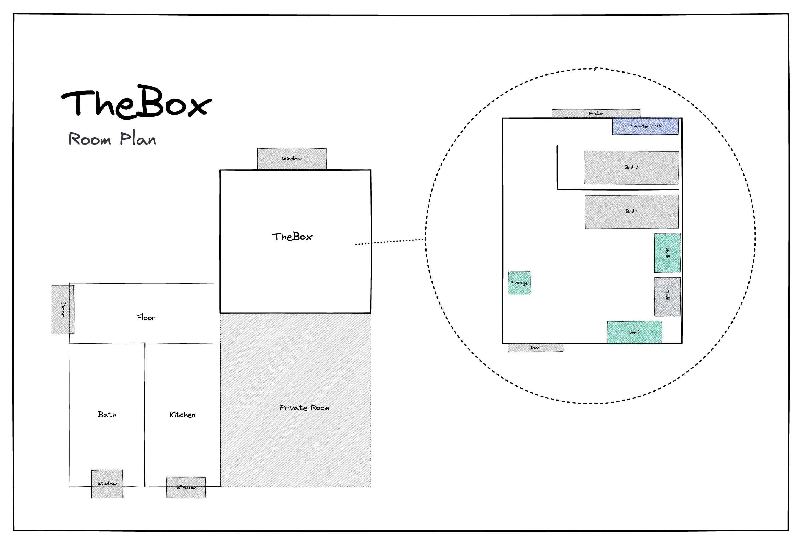

# Willkommen

Hallo und willkommen in der "Box"! Wenn ich auf Reisen bin, übernachte ich auch gern in AirBnB's und manchmal wünschte ich mir einen Zettel, mit allen nötigen Informationen zur Unterkunft, Checkin und Checkout und dies ist mein Versuch es besser zu machen.

## Bilder

Auf meinem AirBnB bekommst Du einen genauen Überblick über alle Zimmer und die Ausstattung. Hier nur ein kurzer Überblick:

<div class="grid">


</div>

# Checkin

## Schlüssel

Du bekommst zwei Schlüsselpaare mit jeweils einem Schlüssel für Unten und einen für Oben. An einem Schlüsselbund ist auch ein Schlüssel, mit dem Du Dein Zimmer abschließen kannst.

## Internetzugang

```txt
SSID:     hamburg-bei-nacht
Passwort: landungsbruecken
```

Oder Du scannst diesen QR code ein, er verbindet dich automatisch mit dem Netz:


# Die Zimmer



## Küche

Da ich meist unten bei meiner Familie esse, ist die Küche sehr spartanisch. Abwaschen geht daher leider nur im Waschbecken im Badezimmer. Es gibt aber eine speziellen Behälter zum abwaschen.


### Folgende Dinge stehen euch zur Verfügung

1. Herd
2. Wasserkocher
3. Geschirr, Besteck
4. Kühlschrank
5. Pizzaof
6. Mineralwasser
7. Handy-Aufladestation im Regal
8. Waschmaschine

### FAQ - Küche

1. Herd funktioniert nicht? Bitte sage
   >"Computer, Werkbank an"
2. Wo kann ich abwaschen? Das geht nur im Bad. Es gibt einen speziellen Behälter zum abwaschen.

## Dein Zimmer

Die Matratzen liegen nur zu Lagerung übereinander. Ihr könnt sie nach euren Bedürfnissen verteilen. Wenn ihr die Kissen auf der Couch durch eine Matratze ersetzt, eignet sie sich gut als Bett.

Den Computer und den Drucker kannst Du gern benutzen.

### Die Zugangsdaten fü den Computer sind

```txt
Nutzer:   thebox
Passwort: thebox
```

### Folgende Dinge stehen euch zur Verfügung

1. Alle Möbel und Betten
2. Computer
3. Fernbedienungen für Licht und Strom

### FAQ - Dein Zimmer

1. Das Licht geht nicht an, oder blinkt ganz wild Benutze die kleine Fernbedienungen mit den bunten Tasten.

### Badezimmer

Die Dusche kannst du ruhig im Stehen benutzen. Es ist nicht schlimm, wenn der Boden etwas nass wird. Dreh das Wasser nur 1/3  auf und häng den Badewannenvorleger  zum trocknen über der Heizung auf.

Die Alexa an der Wand hört auf den Namen "Computer" und spielt dir auch Deine Lieblingsmusik oder Radio. Z. B. "*Computer, spiele Deutschlandfunk Nova*"

Handtücher kannst Du an allen Haken aufhängen und deine Sachen überall abstellen.

### Flur

Hier kannst Du gern deine Schuhe stehenlassen. Ich habe auch einen kleinen Notizblock auf dem Regal, falls Du mir etwas mitteilen möchtest.

# Checkout

## Schlüssel 

* Je nach dem welcher Wochentag ist, können wir uns persönlich verabschieden, oder du legst einfach die Schlüssel auf den Schreibtisch und ziehst die Tür hinter Dir zu.
* Der reguläre Zeitpunkt für den Checkout ist 11 Uhr.
* Wenn Du am Tag der Abreise noch dein Gepäck dalassen möchtest und erst später am Tag abholen möchtest, können wir uns das individuell verabreden.

## Reinigung

* Bettzeug kannst Du drauf lassen.
* Das Geschirr spüle ich auch ab und 
* den Müll bring ich auch raus.

> Kurzfassung: Schlüssel da lassen, Tür zuziehen, das wars. 😀

# Tipps

Mit der Leipzig MOVE App, bekommt ihr 10 Freifahrten à 15 Minuten für die *Nextbikes*. Beachtet, dass es mehr kostet, wenn man die Räder nicht an den großen Straßen (Auf der Karte Lila) abstellt. Die E-Scooter dürfen nur an bestimmten Parkplätzen abgestellt werden.

# Fragen?

Wenn ihr Fragen habt, oder Unterstützung benötigt, stehe ich euch gern zur Verfügung. Wenn es eilig ist, dann besten via Telefon&nbsp; <a href="tel:+491707353067">+49 170 73 53 067</a>. Gern auch über die vorinstallierte Messenger App mit geringem Funktionsumfang (SMS). Ansonsten habe ich im Flur einen Notizblock und einen Stift.

Ich wünsche einen schönen Aufenthalt in Leipzig!
André

---

*Made with ❤️ by &nbsp; [docsify](https://docsify.js.org/)*
