# Welkom

Hallo en welkom bij de “Box”! Als ik reis, verblijf ik ook graag in AirBnB's en soms zou ik willen dat ik een vel papier had met alle nodige informatie over de accommodatie, het in- en uitchecken en dit is mijn poging om het beter te maken.

> [!Een mededeling]Ik zal het document automatisch in uw taal laten vertalen. Ik hoop dat het enigszins begrijpelijk is. Zo niet, schrijf mij dan gerust een bericht. Dan probeer ik het te verbeteren.

## Afbeeldingen

Op mijn AirBnB krijg je een gedetailleerd overzicht van alle kamers en de faciliteiten. Hier is slechts een kort overzicht:

| 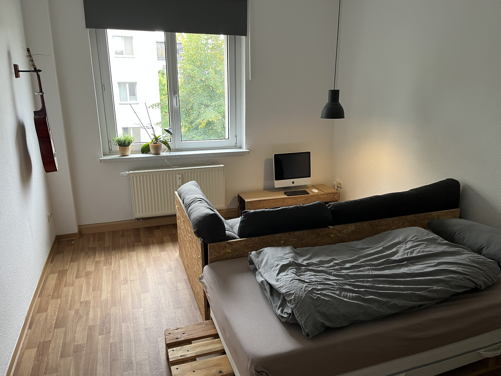          | 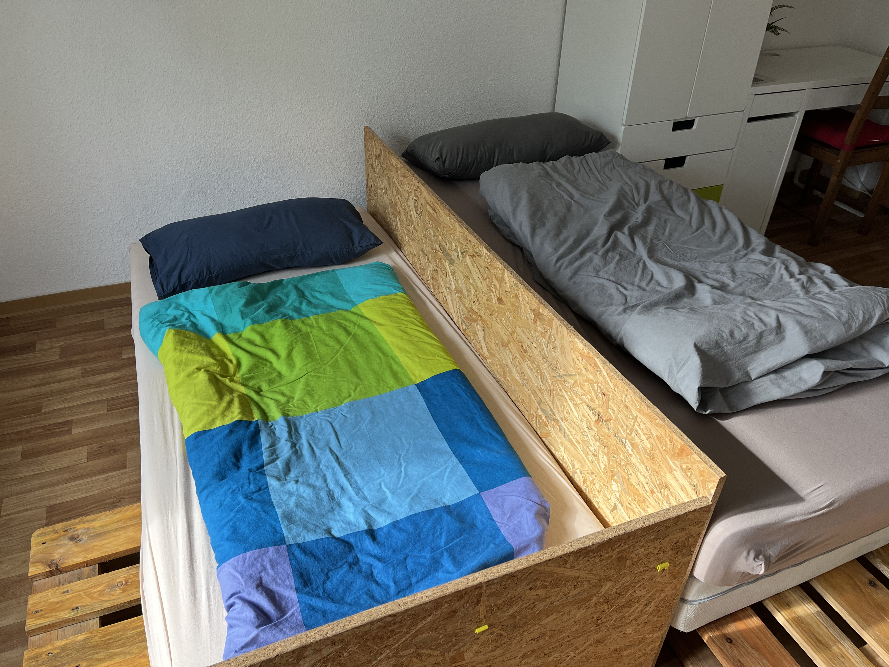   | 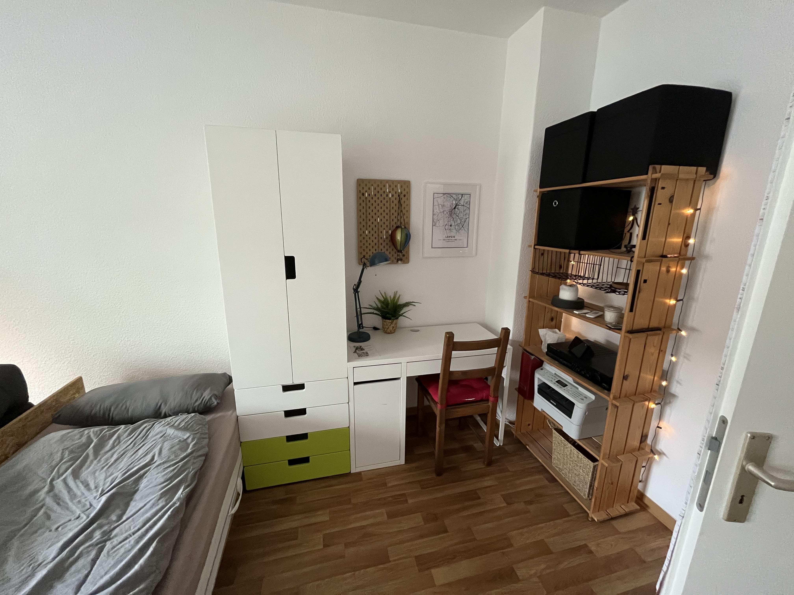 |
| -------------------------------------------------------------------------------------- | ----------------------------------------------------------------------------- | --------------------------------------------------------------------------------------- |
| Eén bedconfiguratie met bank                                                           | Configuratie met twee bedden                                                  | Bureau                                                                                  |
| 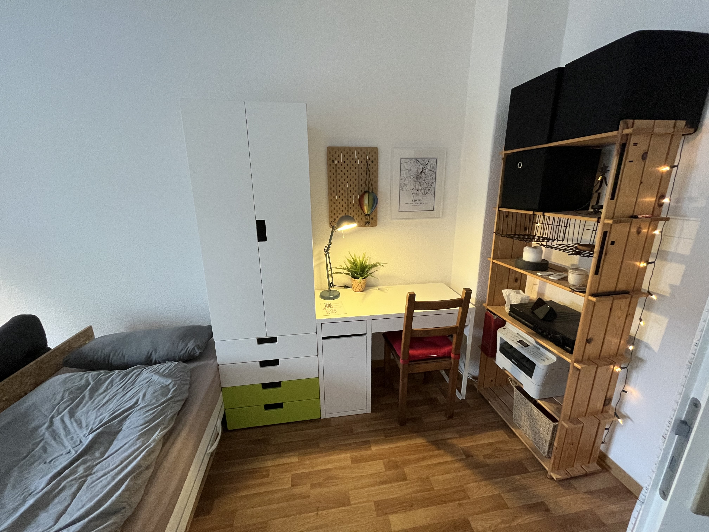 | 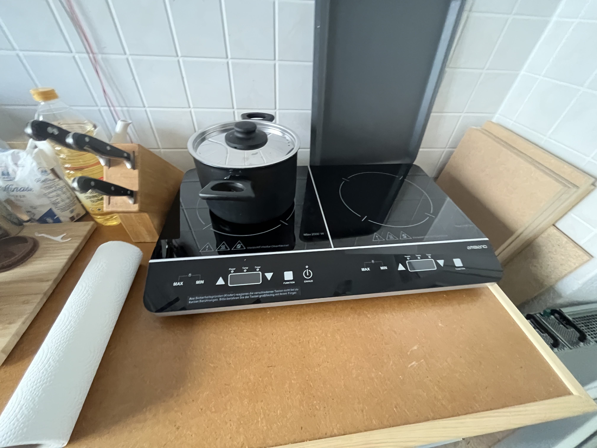           | 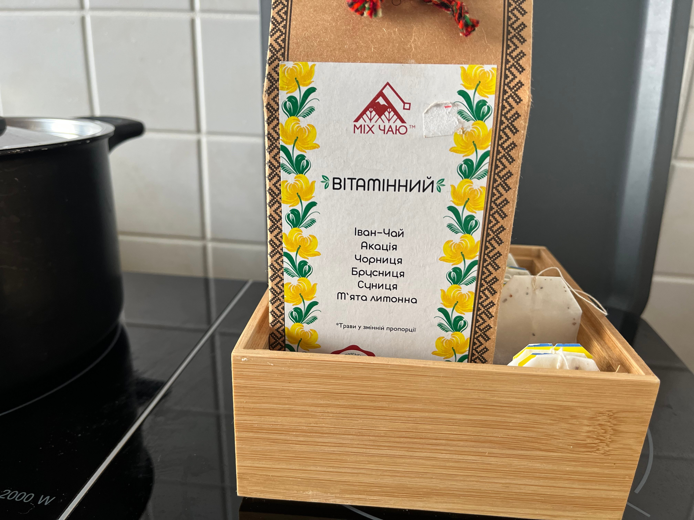                         |
| Bureau met licht                                                                       | Fornuis                                                                       | Keuken - thee                                                                           |
| 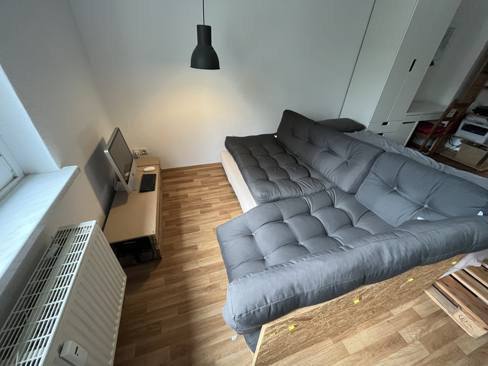           | 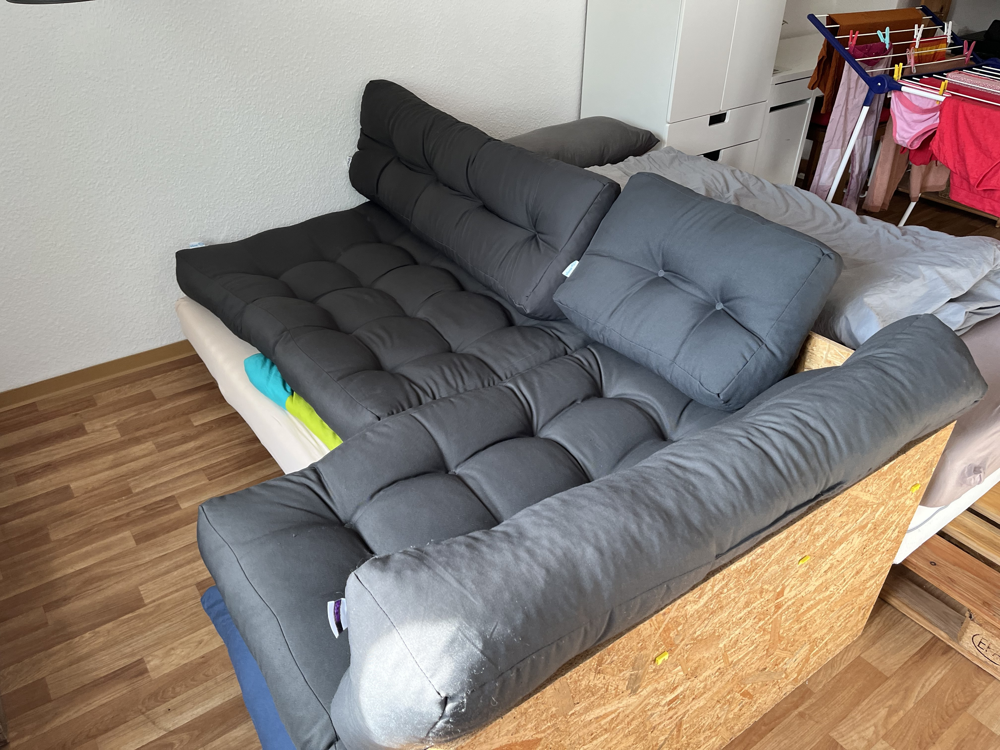 | 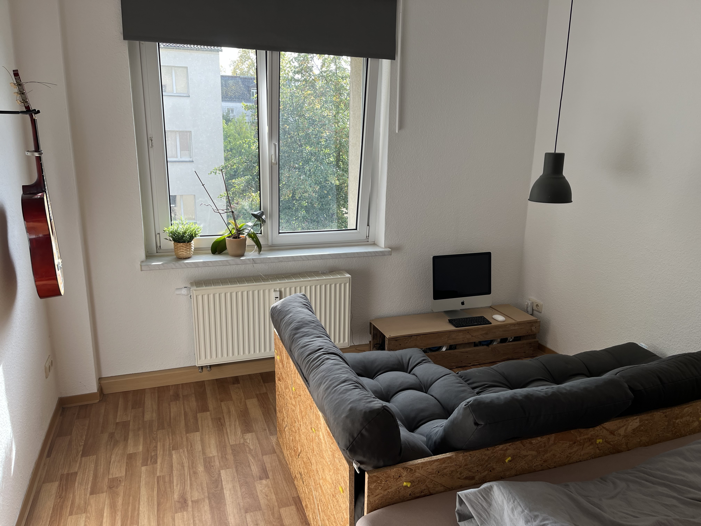           |
| Bureau met licht                                                                       | Fornuis                                                                       | Keuken - thee                                                                           |

## Sleutel

Je krijgt twee paar sleutels, elk met één sleutel voor de onderkant en één voor de bovenkant. Er zit ook een sleutel aan een sleutelhanger waarmee u uw kamer kunt afsluiten.

## internet toegang

```txt
SSID:     hamburg-bei-nacht
Passwort: landungsbruecken
```

Of u scant deze QR-code, deze verbindt u automatisch met het netwerk:

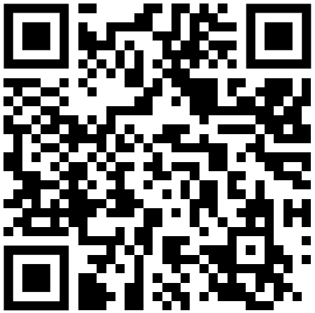

# De kamers

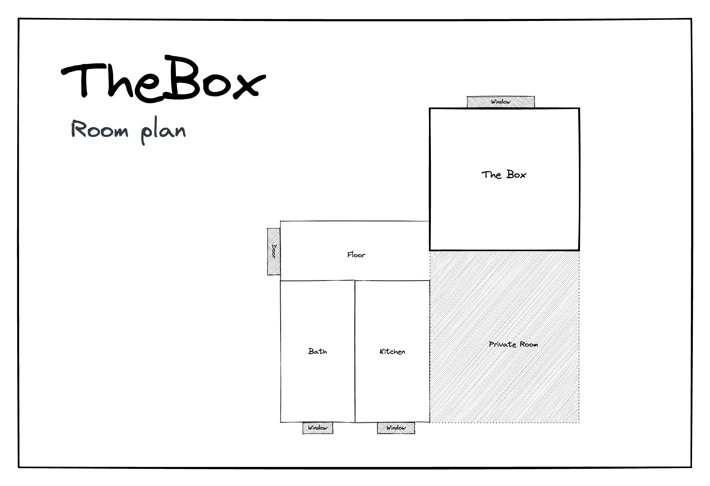

## Keuken

Omdat ik meestal met mijn gezin beneden eet, is de keuken erg spartaans. Afwassen kan helaas alleen in de wastafel in de badkamer. Maar er is een speciale container voor de afwas.

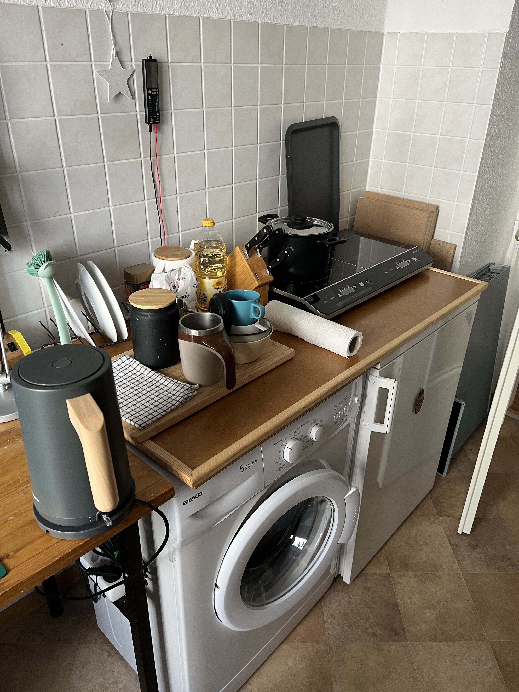

### In de keuken zijn de volgende zaken aanwezig

1.  Kudde
2.  Ketel
3.  Servies bestek
4.  Koelkast
5.  pizza oven
6.  Mineraalwater
7.  Oplaadstation voor mobiele telefoons op de plank
8.  wasmachine

### Veelgestelde vragen - Keuken

1.  Kachel werkt niet? zeg alstublieft
    > "Computer, Werkbank an"
2.  Waar kan ik afwassen? Dit werkt alleen in de badkamer. Er is een speciale container voor het afwassen.

## Jouw kamer

De matrassen worden uitsluitend voor opslagdoeleinden op elkaar geplaatst. U kunt ze verdelen volgens uw behoeften.
Als je de kussens van de bank vervangt door een matras, ontstaat er een goed bed.

### De inloggegevens voor de computer (iMac) zijn

```txt
Nutzer:   thebox
Passwort: thebox
```

### De volgende zaken zijn aanwezig in de kamer

1.  Alle meubels en bedden
2.  Computers en printers
3.  Afstandsbedieningen voor verlichting en elektriciteit

### Afstandsbedieningen

Voor alle afstandsbedieningen geldt een oud Duits gezegde: “Proberen is beter dan studeren”. Je kunt niets breken. Druk op een paar knoppen en kijk wat er gebeurt. Als je nog steeds wilt studeren, is hier de juiste lectuur voor jou:

| Illustratie                                               | Beschrijving                                                                                                                                                                                                                                                          |
| --------------------------------------------------------- | --------------------------------------------------------------------------------------------------------------------------------------------------------------------------------------------------------------------------------------------------------------------- |
| 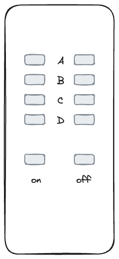  | A: Bluetoothbox<br>B: Kerstverlichting<br>C: Bureaulamp<br>D:_leer_<br>Master: Schakel alles tegelijk                                                                                                                                                                 |
| 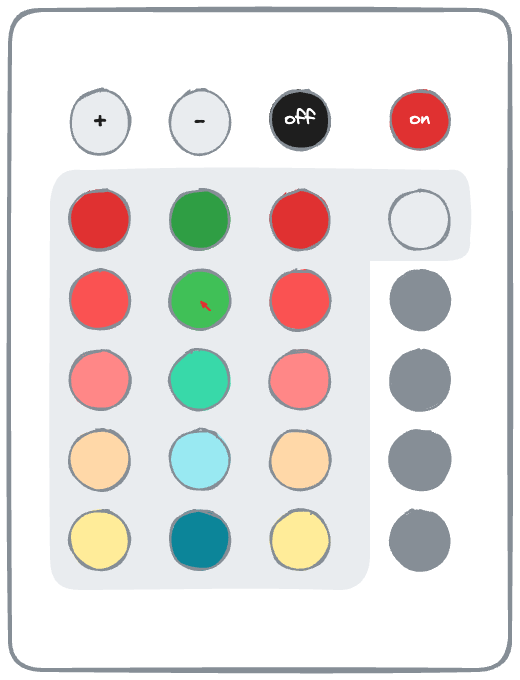 | **Voordat u er gebruik van kunt maken, zorgt u ervoor dat de lichtschakelaar bij de ingang op "aan" staat.**<br>Eerste regel: helderheid, aan/uit<br>Gekleurde knoppen: Hiermee kunt u de kleuren wijzigen<br>Grijze knoppen: Schakelen tussen verschillende effecten |
| 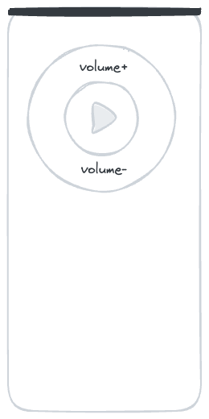    | Dit is de afstandsbediening voor de computer (iMac)._Om de computer te gebruiken, drukt u op de A-knop op de eerste afstandsbediening. Het activeert de voeding voor de computer en de Bluetooth-box._                                                                |

### Veelgestelde vragen - Uw kamer

1.  Het licht gaat niet aan of knippert wild.Gebruik de kleine afstandsbedieningen met de kleurrijke knoppen.

### badkamer

U kunt staand van de douche gebruik maken. Het is geen probleem als de grond een beetje nat wordt. Zet het water slechts 1/3 open en hang de badmat over de verwarming om te drogen.

De Alexa aan de muur heet ‘Computer’ en speelt ook je favoriete muziek of radio af. Bijvoorbeeld "_Computer, speel Deutschlandfunk Nova_"

Je kunt handdoeken aan alle haken ophangen en je spullen overal neerzetten. Voor de badkamerdeur bevindt zich een plank. Eén ervan is van jou.

### Gang

U kunt uw schoenen hier achterlaten. Ik heb ook een klein notitieboekje op de plank liggen, voor het geval je me iets wilt vertellen.

# Gemengd

## Slimme woning

Er zijn Alexa-stemassistenten in de badkamer en keuken. Je kunt ze aanspreken met de naam “Computer” en ze bijvoorbeeld Deutschlandfunk Nova laten spelen. Ze begrijpen Duits en ook Engels. Als u ze niet wilt gebruiken,
Je kunt hem ook eenvoudig loskoppelen van de stroom.

Er zijn geen stemassistenten in uw kamer. In de mand op de plank bevinden zich alleen de router en een kleine computer.

## temperatuur en vochtigheid

Via de sensoren worden de temperatuur en luchtvochtigheid automatisch gemeten. Ik gebruik ze om schimmelvorming te voorkomen. Ze zijn klein en wit en liggen meestal op deurkozijnen. Een deel van de meetgegevens kun je aflezen in de spiegel in de gang.

?> Zorg ervoor dat u regelmatig ventileert (minstens één keer per dag). Vooral in de badkamer. Zorg er ook voor dat de verwarming uitgeschakeld is. Bedankt 🙏

## De tuin

Op onze binnenplaats kunt u uw fietsen aansluiten en uw afval meenemen.

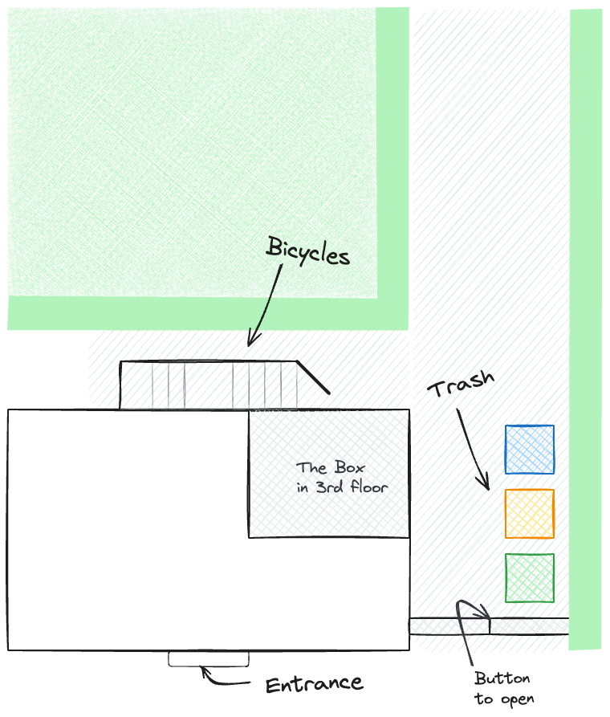

### Hoe gaat de poort open?

Of je gebruikt de sleutel van de voordeur, of je reikt door het hek en voelt aan de knop om de deur te openen. Terwijl u de knop ingedrukt houdt, kunt u de deur openen.

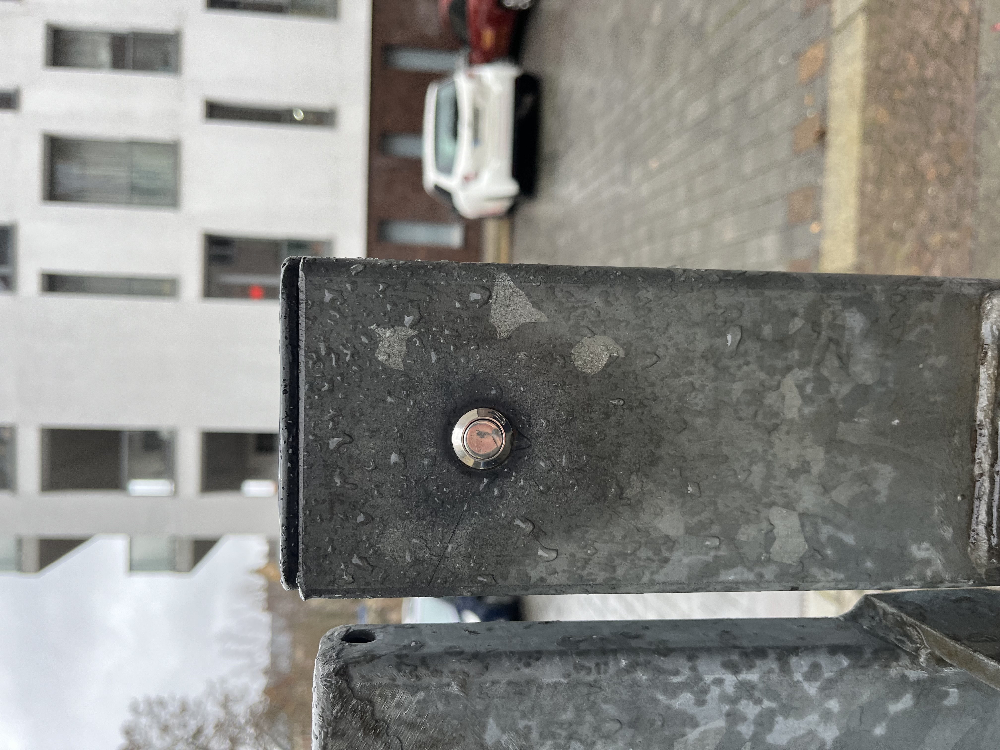

### Geel? Blauw? Groente? Bruin?

Vraag je je af waarom de vuilnisbakken verschillende kleuren hebben? Als u het niet zeker weet, deponeer het afval dan altijd in de groene bak. Daarin komt het restafval terecht. Professionals gooien papierafval in de blauwe bak, recyclebaar afval in de gele bak en organisch afval in de bruine bak.

### Cycli

### Is mijn fiets veilig?

Leipzig is een zeer fietsvriendelijke stad. Via het grote stadspark dat de stad in twee helften verdeelt, kun je op veel plekken komen en meestal door het platteland rijden.
Als je de statistieken mag geloven, worden in Leipzig jaarlijks de meeste fietsen per hoofd van de bevolking gestolen. (1.539 gestolen fietsen per 100.000 inwoners) In de 15 jaar sinds ik hier aan de Hardenbergstraße woon, is er nog nooit een fiets gestolen en ken ik slechts één buurman wiens fiets uit zijn achtertuin is gestolen. Ik sluit hem altijd rechtstreeks aan op de reling.

### Welke alternatieven zijn er?

Met de[Leipzig MOVE-app](https://leipzig-move.de/), krijg je 10 gratis ritten van elk 15 minuten voor de_Volgendefietsen_. Houd er rekening mee dat het duurder is als u uw fietsen niet in de hoofdstraten parkeert (paars op de kaart). De e-scooters mogen alleen op bepaalde parkeerplaatsen geparkeerd worden. Er is ook een free-float autodeelsysteem. Dat betekent bij ons[stadsflitzer](https://cityflitzer.de/). En natuurlijk zijn er bussen en treinen die je ook via de Leipzig MOVE-app kunt betalen.

# Uitchecken

## Sleutel

-   Afhankelijk van welke dag van de week het is, kunnen wij persoonlijk afscheid nemen, of u legt gewoon de sleutels op het bureau en sluit de deur achter u.
-   Het uiterste tijdstip voor uitchecken is 19.00 uur op de dag van vertrek.

## schoonmaak

-   Je kunt er beddengoed op laten liggen.
-   Ik doe ook de afwas en
-   Ik zet ook het afval buiten.

> Korte versie: Laat de sleutel daar liggen, sluit de deur, dat is alles. 😀

# Langer verblijf

?> Sommige van mijn gasten blijven een maand of langer. Als jij een van hen bent, dan is deze sectie iets voor jou!

## wasmachine

U kunt de wasmachine gebruiken zonder dat u dit eerst hoeft te vragen. Ook kun je gebruik maken van het droogrek, waspoeder en wasverzachter. Wilt u nieuw beddengoed, neem dan contact met mij op.

## Handborstel en blik

In de keuken vind je een handveger en een blik aan de muur. Dit zal je helpen om het kleine vuil te verwijderen.

## Veeg

Groen schoonmaakmiddel vind je in een spuitflesje in de badkamer om mee te dweilen. Samen met het keukenpapier kan dit gebruikt worden om oppervlakken eenvoudig schoon te maken.

## Stofzuiger

Ik heb een robotstofzuiger voor de vloer.
Voordat je kunt beginnen, ruim je alles op de vloer uit de weg.
Vooral snoeren of andere zaken waar de robot in zou kunnen stikken.
Zet hem dan in je kamer en druk één keer op de knop bovenaan.
Als er niets gebeurt, gebruik dan de aan/uit-schakelaar aan de zijkant en erna
zet hem weer aan met de knop bovenaan.

Als hij klaar is, plaats hem dan terug in het laadstation!

# Tips

Met de[Leipzig MOVE-app](https://leipzig-move.de/), krijg je 10 gratis ritten van elk 15 minuten voor de_Volgendefietsen_.
Houd er rekening mee dat het meer kost als u de Raf niet in de hoofdstraten parkeert (paars op de kaart).
De e-scooters mogen alleen op bepaalde parkeerplaatsen geparkeerd worden.

Ik heb reisgidsen opgeslagen in de AirBnB-app. Daar vindt u mijn aanbevelingen voor bezienswaardigheden, bars en pubs, winkelmogelijkheden en restaurants.

# Vragen?

Als je vragen hebt of ondersteuning nodig hebt, help ik je graag verder.
Als u haast heeft, kunt u dit het beste telefonisch doen <a href="tel:+491707353067">+49 170 73 53 067</a>.
U kunt ook de vooraf geïnstalleerde messenger-app met beperkte functionaliteit (SMS) gebruiken.
Anders heb ik een notitieblok en een pen in de gang.

Ik wens u een prettig verblijf in Leipzig!
André

* * *

_Gemaakt met ❤️ door [documenteren](https://docsify.js.org/)_
