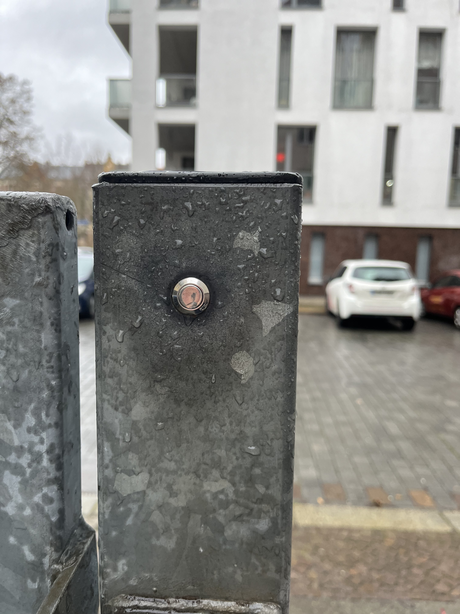

# Velkommen til Boksen

Hei og velkommen til «boksen»! Når jeg reiser liker jeg også å bo i AirBnB's og noen ganger skulle jeg ønske jeg hadde et papir med all nødvendig informasjon om overnatting, innsjekking og utsjekking og dette er mitt forsøk på å gjøre det bedre.

> [!En merknad]Jeg vil få dokumentet automatisk oversatt til ditt språk. Jeg håper det er litt forståelig. Hvis ikke, skriv gjerne en melding til meg. Da prøver jeg å forbedre det.

## Bilder

På min AirBnB får du en detaljert oversikt over alle rommene og fasilitetene. Her er bare en kort oversikt:

|           |    |  |
| -------------------------------------------------------------------------------------- | ----------------------------------------------------------------------------- | --------------------------------------------------------------------------------------- |
| En seng konfigurasjon med sofa                                                         | Konfigurasjon med to senger                                                   | Pulten                                                                                  |
|  |            |                          |
| Skrivebord med lys                                                                     | Kjøkken - komfyr                                                              | Kjøkken - te                                                                            |
|            |  |            |
| Skrivebord med lys                                                                     | Kjøkken - komfyr                                                              | Kjøkken - te                                                                            |

## Nøkkel

Du får to par nøkler, hver med en nøkkel for bunnen og en for toppen. Det er også en nøkkel på en nøkkelring som du kan bruke til å låse rommet ditt.

## Internettilgang

```txt
SSID:     hamburg-bei-nacht
Passwort: landungsbruecken
```

Eller du skanner denne QR-koden, den vil automatisk koble deg til nettverket:


# Rommene


## Kjøkken

Siden jeg vanligvis spiser nede med familien min, er kjøkkenet veldig spartansk. Dessverre kan oppvask kun gjøres i vasken på badet. Men det er en spesiell beholder for oppvask.


### Følgende ting er tilgjengelig på kjøkkenet

1.  Flokk
2.  Kjele
3.  Tallerkener bestikk
4.  Kjøleskap
5.  Pizzaovn
6.  Mineralvann
7.  Mobilladestasjon i hylla
8.  vaskemaskin

### FAQ - Kjøkken

1.  Fungerer ikke komfyren? Vennligst si
    > "Datamaskin, arbeidsbenk og"
2.  Hvor kan jeg vaske opp? Dette fungerer kun på badet. Det er en spesiell beholder for oppvask.

## Rommet ditt

Madrassene er plassert oppå hverandre kun for oppbevaringsformål. Du kan distribuere dem i henhold til dine behov.
Bytter du ut putene på sofaen med en madrass, fungerer den fint som seng.

### Påloggingsdetaljene for datamaskinen (iMac) er

```txt
Nutzer:   thebox
Passwort: thebox
```

### Følgende ting er tilgjengelig i rommet

1.  Alle møbler og senger
2.  Datamaskiner og skrivere
3.  Fjernkontroller for lys og strøm

### Fjernkontroller

Et gammelt tysk ordtak gjelder for alle fjernkontroller: «Å prøve er bedre enn å studere». Du kan ikke bryte noe. Trykk på noen få knapper og se hva som skjer. Hvis du fortsatt ønsker å studere, her er den rette lesestoffet for deg:

| Illustrasjon                                              | Beskrivelse                                                                                                                                                                                                               |
| --------------------------------------------------------- | ------------------------------------------------------------------------------------------------------------------------------------------------------------------------------------------------------------------------- |
|   | A: Bluetoothbox<br>B: Fairy lights<br>C: Skrivebordslampe<br>D:_fil_<br>Mester: Bytt alt på samme tid                                                                                                                     |
|  | **Før du kan bruke den, sørg for at lysbryteren ved inngangen er satt til "på".**<br>Første linje: lysstyrke, på/av<br>Fargede knapper: Du kan bruke denne til å endre fargene<br>Grå knapper: Bytt mellom ulike effekter |
|     | Dette er fjernkontrollen til datamaskinen (iMac)._For å bruke datamaskinen, trykk på A-knappen på den første fjernkontrollen. Den aktiverer strømforsyningen til datamaskinen og Bluetooth-boksen._                       |

### FAQ - Rommet ditt

1.  Lyset tennes ikke eller blinker vilt Bruk de små fjernkontrollene med de fargerike knappene.

### baderom

Du kan bruke dusjen mens du står. Det er ikke noe problem hvis bakken blir litt våt. Slå bare på vannet 1/3 og heng badematten over varmeren for å tørke.

Alexaen på veggen går under navnet "Computer" og spiller også favorittmusikken eller radioen din. f.eks."_Datamaskin, spill Deutschlandfunk Nova_"

Du kan henge håndklær på alle kroker og sette tingene dine hvor som helst. Det er en hylle foran baderomsdøren. En av dem er din.

### Gang

Du er velkommen til å legge igjen skoene dine her. Jeg har også en liten notisblokk i hyllen i tilfelle du vil fortelle meg noe.

# Diverse

## Smart hjem

Det er Alexa stemmeassistenter på badet og kjøkkenet. Du kan adressere dem med navnet "Computer" og la dem spille Deutschlandfunk Nova, for eksempel. De forstår tysk og også engelsk. Hvis du ikke vil bruke dem,
Du kan også enkelt koble den fra strømmen.

Det er ingen stemmeassistenter på rommet ditt. Kurven på hyllen inneholder kun ruteren og en liten datamaskin.

## temperatur og fuktighet

Temperatur og fuktighet måles automatisk via sensorene. Jeg bruker dem for å hindre muggdannelse. De er små og hvite og ligger vanligvis på dørkarmer. Noen av måledataene kan du lese i speilet i gangen.

?> Sørg for å ventilere regelmessig (minst en gang om dagen). Spesielt på badet. Pass også på at varmen er slått av. Takk 🙏

## Hagen

På gårdsplassen vår kan du koble sammen syklene og ta bort søppelet ditt.


### Hvordan åpnes porten?

Enten bruker du hoveddørnøkkelen, eller så strekker du deg gjennom porten og kjenner på knappen for å åpne døren. Mens du holder inne knappen kan du åpne døren.



### Gelb? Blau? Grün? Braun?

Lurer du på hvorfor søppeldunkene har forskjellige farger? Hvis du er usikker, legg alltid søppelet i den grønne søppelbøtta. Der havner restavfallet. Fagfolk legger papiravfall i den blå søppelkassen, resirkulerbart i den gule søppelkassen og organisk avfall i den brune søppelbøtta.

### Sykluser

### Er sykkelen min trygg?

Leipzig er en veldig sykkelvennlig by. Gjennom den store byparken som deler byen i to halvdeler, kan du komme deg til mange steder og kjører vanligvis gjennom landsbygda.
Skal man tro statistikken, så stjeles flest sykler per innbygger i Leipzig hvert år. (1 539 stjålne sykler per 100 000 innbyggere) I løpet av de 15 årene siden jeg har bodd her på Hardenbergstra른 har jeg aldri fått stjålet en sykkel og jeg vet bare om en nabo som har fått sykkelen hans stjålet fra bakgården hans. Jeg kobler den alltid direkte til rekkverket.

### Hvilke alternativer finnes?

Med[Leipzig MOVE App](https://leipzig-move.de/), får du 10 gratisturer på 15 minutter hver for_Nextbikes_. Merk at det koster mer hvis du ikke parkerer syklene i hovedgatene (lilla på kartet). El-scooterne kan kun parkeres på enkelte parkeringsplasser. Det er også et gratis-flytende bildelingssystem. Det betyr med oss[cityflitzer](https://cityflitzer.de/). Og selvfølgelig er det busser og tog som du også kan betale for via Leipzig MOVE-appen.

# Sjekk ut

## Nøkkel

-   Avhengig av hvilken ukedag det er, kan vi si farvel personlig, eller du kan ganske enkelt legge nøklene på skrivebordet og lukke døren bak deg.
-   Siste tidspunkt for utsjekking er 19.00 på avreisedagen.

## rengjøring

-   Du kan la sengetøy ligge på den.
-   Jeg vasker også oppvask og
-   Jeg tar også ut søppelet.

> Kortversjon: La nøkkelen ligge der, lukk døren, det er det. 😀

# Lengre opphold

?> Noen av gjestene mine blir i en måned eller lenger. Hvis du er en av dem, så er denne delen for deg!

## vaskemaskin

Du kan bruke vaskemaskinen uten å måtte spørre først. Du kan også bruke tørkestativet, vaskepulver og tøymykner. Hvis du vil ha nytt sengetøy, bare snakk med meg.

## Håndbørste og støvbrett

På kjøkkenet finner du en håndbørste og en feiebrett på veggen. Dette vil hjelpe deg å bli kvitt den lille skitten.

## Tørke

Du kan finne grønt rengjøringsmiddel i en sprayflaske på badet for mopping. Sammen med kjøkkenpapiret kan dette brukes til å rengjøre overflater enkelt.

## Støvsuger

Jeg har en robotstøvsuger til gulvet.
Før du kan begynne, ryd alt på gulvet ut av veien.
Spesielt ledninger eller andre ting som roboten kunne kveles på.
Sett den deretter på rommet ditt og trykk på knappen på toppen én gang.
Hvis ingenting skjer, bruk av/på-bryteren på siden og etter
slå den på igjen med knappen på toppen.

Når den er ferdig, sett den tilbake i ladestasjonen!

# Tips

Med[Leipzig MOVE App](https://leipzig-move.de/), får du 10 gratisturer på 15 minutter hver for_Nextbikes_.
Merk at det koster mer hvis du ikke parkerer Raf i hovedgatene (lilla på kartet).
El-scooterne kan kun parkeres på enkelte parkeringsplasser.

Jeg har lagret reiseguider i AirBnB-appen. Der finner du mine anbefalinger for severdigheter, barer og puber, shoppingmuligheter og restauranter.

# Spørsmål?

Hvis du har spørsmål eller trenger støtte, hjelper jeg deg gjerne.
Hvis du har det travelt, er det best å gjøre det via telefon <a href="tel:+491707353067">+49 170 73 53 067</a>.
Du kan også bruke den forhåndsinstallerte messenger-appen med begrenset funksjonalitet (SMS).
Ellers har jeg en notatblokk og en penn i gangen.

Jeg ønsker deg et godt opphold i Leipzig!
Andre

* * *

_Laget med ❤️ av [dokumentere](https://docsify.js.org/)_
