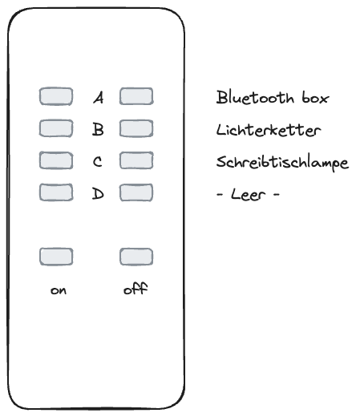

# Powitanie

Witamy w „Boxie”! Kiedy podróżuję, lubię też nocować w AirBnB i czasami żałuję, że nie mam kartki papieru ze wszystkimi niezbędnymi informacjami na temat zakwaterowania, zameldowania i wymeldowania, i to jest moja próba ulepszenia tego.

## Kino

Na moim AirBnB otrzymasz szczegółowy przegląd wszystkich pokoi i udogodnień. Oto krótki przegląd:

|           |    |  |
| -------------------------------------------------------------------------------------- | ----------------------------------------------------------------------------- | --------------------------------------------------------------------------------------- |
| Konfiguracja z jednym łóżkiem i kanapą                                                 | Konfiguracja z dwoma łóżkami                                                  | Biurko                                                                                  |
|  |            |                          |
| Schreibtisch mit Licht                                                                 | Kuchenka                                                                      | Kuchnia - herbata                                                                       |
|            |  |            |
| Biurko ze światłem                                                                     | Kuchenka                                                                      | Küche - Tee                                                                             |

# Zameldować się

## Klucz

Otrzymujesz dwie pary kluczy, każdy z jednym kluczem na dole i jednym na górze. Na breloczku znajduje się również klucz, za pomocą którego można zamknąć pokój.

## dostęp do Internetu

```txt
SSID:     hamburg-bei-nacht
Passwort: landungsbruecken
```

Lub zeskanuj ten kod QR, automatycznie połączy Cię z siecią:


# Pokoje

!\[[thebox-map.png]]

## Kuchnia

Ponieważ zazwyczaj jadam z rodziną na dole, kuchnia jest bardzo spartańska. Niestety zmywanie można robić tylko w zlewie w łazience. Ale jest specjalny pojemnik do mycia naczyń.


### Dostępne są następujące rzeczy

1.  Stado
2.  Czajnik
3.  Naczynia sztućce
4.  Lodówka
5.  Pizza
6.  Woda mineralna
7.  Stacja ładowania telefonów komórkowych na półce
8.  pralka

### Często zadawane pytania - Kuchnia

1.  Piec nie działa? proszę powiedz
    > „Komputer, stół warsztatowy”
2.  Gdzie mogę się umyć? To działa tylko w łazience. Jest specjalny pojemnik do mycia naczyń.

## Twój pokój

Materace są ułożone jeden na drugim wyłącznie w celu przechowywania. Możesz je dystrybuować według swoich potrzeb. Jeśli zastąpisz poduszki na kanapie materacem, będzie to dobre łóżko.

Zapraszamy do korzystania z komputera i drukarki.

### Die Zugangsdaten fü den Computer sind

```txt
Nutzer:   thebox
Passwort: thebox
```

### Dostępne są następujące rzeczy

1.  Wszystkie meble i łóżka
2.  Komputer
3.  Piloty do sterowania oświetleniem i prądem

### Zdalne sterowanie



### Często zadawane pytania - Twój pokój

1.  Światło nie włącza się lub miga gwałtownie. Użyj małych pilotów z kolorowymi przyciskami.

### łazienka

Z prysznica można korzystać na stojąco. Nie stanowi to problemu, jeśli ziemia lekko zamoknie. Odkręć wodę tylko na 1/3 i zawieś matę do kąpieli nad grzejnikiem, aby wyschła.

Alexa na ścianie nosi nazwę „Komputer” i odtwarza także Twoją ulubioną muzykę lub radio. Np. "_Komputerze, włącz Deutschlandfunk Nova_"

Możesz powiesić ręczniki na wszystkich haczykach i położyć swoje rzeczy w dowolnym miejscu.

### Korytarz

Zapraszamy do pozostawienia tutaj swoich butów. Mam też na półce mały notatnik, na wypadek gdybyś chciała mi coś powiedzieć.

# Różnorodny

## Inteligentny dom

W mieszkaniu znajdują się asystenci głosowi Alexa. Możesz zwrócić się do nich nazwą „Komputer” i na przykład poprosić ich o zagranie w Deutschlandfunk Nova. Urządzenia są podłączone do Internetu i mogą służyć również jako budziki lub timery. Jeśli nie chcesz z niego korzystać, możesz po prostu odłączyć go od źródła zasilania.

W Twoim pokoju nie ma asystentów głosowych. W koszyku na półce mieści się tylko router i mały komputer.

## temperatura i wilgotność

Temperatura i wilgotność są mierzone automatycznie za pomocą czujników. Używam ich, aby zapobiec tworzeniu się pleśni. Są małe i białe i zwykle leżą na ościeżnicach drzwi. Można wykorzystać część danych pomiarowych
Czytam cię w lustrze na korytarzu.

# Wymeldować się

## Schlüssel

-   W zależności od tego, jaki jest dzień tygodnia, możemy pożegnać się osobiście lub po prostu odłożyć klucze na biurko i zamknąć za sobą drzwi.
-   Standardowy czas wymeldowania to 11:00.
-   Jeśli chcieliby Państwo zostawić bagaż w dniu wyjazdu i odebrać go dopiero później tego samego dnia, możemy to ustalić indywidualnie.

## czyszczenie

-   Można na nim zostawić pościel.
-   Zmywam też naczynia i
-   Wynoszę też śmieci.

> Wersja krótka: Zostaw klucz tam, zamknij drzwi i to wszystko. 😀

# Porady

Dzięki aplikacji Leipzig MOVE zyskujesz 10 bezpłatnych przejazdów po 15 minut każdy_Następnerowery_. Pamiętaj, że jeśli nie parkujesz rowerów przy głównych ulicach (fioletowe na mapie), kosztuje to więcej. Hulajnogi elektryczne można parkować wyłącznie na określonych miejscach parkingowych.

# Pytania?

Jeśli masz jakieś pytania lub potrzebujesz wsparcia, chętnie Ci pomogę. Jeśli się spieszysz, najlepiej zrobić to telefonicznie <a href="tel:+491707353067">+49 170 73 53 067</a>. Możesz także skorzystać z preinstalowanej aplikacji komunikatora o ograniczonej funkcjonalności (SMS). W przeciwnym razie mam notatnik i długopis na korytarzu.

Życzę miłego pobytu w Lipsku!
Andre

* * *

_Wykonane z ❤️ przez [dokumentować](https://docsify.js.org/)_
