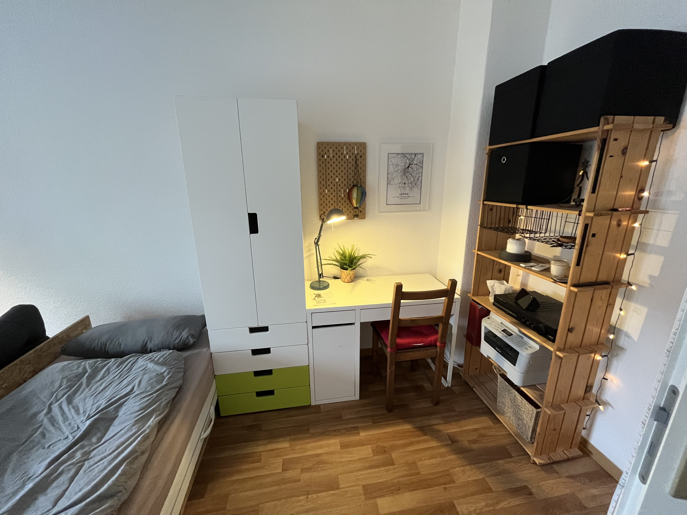

# Witamy w Pudełku

Witamy w „Boxie”! Kiedy podróżuję, lubię też nocować w AirBnB i czasami żałuję, że nie mam kartki papieru ze wszystkimi niezbędnymi informacjami na temat zakwaterowania, zameldowania i wymeldowania, i to jest moja próba ulepszenia tego.

> [!Uwaga]Dokument zostanie automatycznie przetłumaczony na Twój język. Mam nadzieję, że jest to w miarę zrozumiałe. Jeśli nie, śmiało napisz do mnie wiadomość. Potem próbuję to poprawić.

## Kino

Na moim AirBnB otrzymasz szczegółowy przegląd wszystkich pokoi i udogodnień. Oto krótki przegląd:

|           |    |  |
| -------------------------------------------------------------------------------------- | ----------------------------------------------------------------------------- | --------------------------------------------------------------------------------------- |
| Konfiguracja z jednym łóżkiem i kanapą                                                 | Konfiguracja z dwoma łóżkami                                                  | Biurko                                                                                  |
|  |            |                          |
| Biurko ze światłem                                                                     | Kuchenka                                                                      | Kuchnia - herbata                                                                       |
|            |  |            |
| Biurko ze światłem                                                                     | Kuchenka                                                                      | Kuchnia - herbata                                                                       |

## Klucz

Otrzymujesz dwie pary kluczy, każdy z jednym kluczem na dole i jednym na górze. Na breloczku znajduje się również klucz, za pomocą którego można zamknąć pokój.

## dostęp do Internetu

```txt
SSID:     hamburg-bei-nacht
Passwort: landungsbruecken
```

Lub zeskanuj ten kod QR, automatycznie połączy Cię z siecią:


# Pokoje


## Kuchnia

Ponieważ zazwyczaj jadam z rodziną na dole, kuchnia jest bardzo spartańska. Niestety zmywanie można robić tylko w zlewie w łazience. Ale jest specjalny pojemnik do mycia naczyń.


### W kuchni dostępne są następujące rzeczy

1.  Stado
2.  Wasserkocher
3.  Naczynia sztućce
4.  Lodówka
5.  piec do pizzy
6.  Woda mineralna
7.  Stacja ładowania telefonów komórkowych na półce
8.  pralka

### Często zadawane pytania - Kuchnia

1.  Piec nie działa? proszę powiedz
    > „Komputer, stół warsztatowy”
2.  Gdzie mogę się umyć? To działa tylko w łazience. Jest specjalny pojemnik do mycia naczyń.

## Twój pokój

Materace są ułożone jeden na drugim wyłącznie w celu przechowywania. Możesz je dystrybuować według swoich potrzeb.
Jeśli zastąpisz poduszki na kanapie materacem, sprawdzi się ona również jako łóżko.

### Dane logowania do komputera (iMac) to

```txt
Nutzer:   thebox
Passwort: thebox
```

### W pokoju dostępne są następujące rzeczy

1.  Wszystkie meble i łóżka
2.  Komputery i drukarki
3.  Piloty do sterowania oświetleniem i prądem

### Zdalne sterowanie

Stare niemieckie powiedzenie dotyczy wszystkich pilotów: „Lepiej próbować niż się uczyć”. Nie możesz niczego złamać. Naciśnij kilka przycisków i zobacz, co się stanie. Jeśli nadal chcesz się uczyć, oto odpowiednia lektura dla Ciebie:

| Ilustracja                                                | Opis                                                                                                                                                                                                                                                                             |
| --------------------------------------------------------- | -------------------------------------------------------------------------------------------------------------------------------------------------------------------------------------------------------------------------------------------------------------------------------- |
|   | Odp.: Bluetoothbox<br>B: Bajkowe światełka<br>C: Lampka na biurko<br>D:_plik_<br>Mistrz: Przełącz wszystko w tym samym czasie                                                                                                                                                    |
|  | **Zanim będziesz mógł z niego skorzystać, upewnij się, że włącznik światła przy wejściu jest ustawiony na â€włączonyâ€.**<br>Pierwsza linia: jasność, wł./wył<br>Kolorowe przyciski: Można ich używać do zmiany kolorów<br>Szare przyciski: przełączanie pomiędzy różnymi efektami |
|     | To jest pilot do komputera (iMac)._Aby skorzystać z komputera, naciśnij przycisk A na pierwszym pilocie. Aktywuje zasilanie komputera i modułu Bluetooth._                                                                                                                       |

### Często zadawane pytania - Twój pokój

1.  Światło nie włącza się lub miga gwałtownie. Użyj małych pilotów z kolorowymi przyciskami.

### łazienka

Z prysznica można korzystać na stojąco. Nie stanowi to problemu, jeśli ziemia lekko zamoknie. Odkręć wodę tylko na 1/3 i zawieś matę do kąpieli nad grzejnikiem, aby wyschła.

Alexa na ścianie nosi nazwę „Komputer” i odtwarza także Twoją ulubioną muzykę lub radio. Np. "_Komputerze, włącz Deutschlandfunk Nova_"

Możesz powiesić ręczniki na wszystkich haczykach i położyć swoje rzeczy w dowolnym miejscu. Przed drzwiami do łazienki znajduje się półka. Jeden z nich jest Twój.

### Korytarz

Zapraszamy do pozostawienia tutaj swoich butów. Mam też na półce mały notatnik, na wypadek gdybyś chciała mi coś powiedzieć.

# Różnorodny

## Inteligentny dom

W łazience i kuchni znajdują się asystenci głosowi Alexa. Możesz zwrócić się do nich nazwą „Komputer” i na przykład poprosić ich o zagranie w Deutschlandfunk Nova. Rozumieją niemiecki i angielski. Jeśli nie chcesz z nich korzystać,
Można go także po prostu odłączyć od zasilania.

W Twoim pokoju nie ma asystentów głosowych. W koszyku na półce mieści się tylko router i mały komputer.

## temperatura i wilgotność

Temperatura i wilgotność są mierzone automatycznie za pomocą czujników. Używam ich, aby zapobiec tworzeniu się pleśni. Są małe i białe i zwykle leżą na ościeżnicach drzwi. Część danych pomiarowych możesz odczytać w lustrze w przedpokoju.

?> Pamiętaj o regularnej wentylacji (przynajmniej raz dziennie). Szczególnie w łazience. Upewnij się także, że ogrzewanie jest wyłączone. Dziękuję 🙏

## Podwórko

Na naszym dziedzińcu możesz podłączyć rowery i wywieźć śmieci.


### Jak otwiera się brama?

Albo użyjesz klucza do drzwi wejściowych, albo sięgniesz przez bramę i poczujesz przycisk, aby otworzyć drzwi. Przytrzymując przycisk możesz otworzyć drzwi.


### Żółty? Niebieski? Zielony? Brązowy?

Zastanawiasz się dlaczego kosze na śmieci mają różne kolory? Jeżeli nie jesteś pewien, zawsze wrzucaj śmieci do zielonego kosza. Tam trafiają resztki odpadów. Profesjonaliści wrzucają odpady papierowe do niebieskiego pojemnika, surowce wtórne do żółtego, a odpady organiczne do brązowego.

### Cykle

### Czy mój rower jest bezpieczny?

Leipzig ist eine sehr Fahrradfreundliche Stadt. Durch den großen Stadtpark der die Stadt in zwei hälften teilt, gelangt man an viele Orte und fährt dabei meist durchs Grüne.
Glaubt man der Statistik, dann werden in Leipzig jährlich die meisten Fährräder pro Kopf gestohlen. (1.539 gestohlene Fahrräder pro 100.000 Einwohner) In den 15 Jahren seitdem ich hier in der Hardenbergstraße wohne, wurde mir allerdings noch nie ein Fahrrad gestohlen und ich weiß auch nur von einem Nachbarn, dem das Rad vom Hinterhof gestohlen wurde. Ich schließe es immer direkt am Geländer an.

### Jakie są alternatywy?

Z[Aplikacja Lipsk MOVE](https://leipzig-move.de/), otrzymasz 10 bezpłatnych przejazdów po 15 minut każdy dla_Następnerowery_. Pamiętaj, że jeśli nie parkujesz rowerów przy głównych ulicach (fioletowe na mapie), kosztuje to więcej. Hulajnogi elektryczne można parkować wyłącznie na określonych miejscach parkingowych. Istnieje również bezpłatny system wspólnego korzystania z samochodów. To znaczy z nami[miejskiflitzer](https://cityflitzer.de/). Oczywiście są też autobusy i pociągi, za które można zapłacić także za pomocą aplikacji Leipzig MOVE.

# Wymeldować się

## Klucz

-   W zależności od tego, jaki jest dzień tygodnia, możemy pożegnać się osobiście lub po prostu odłożyć klucze na biurko i zamknąć za sobą drzwi.
-   Najpóźniejszy termin wymeldowania to godzina 19:00 w dniu wyjazdu.

## czyszczenie

-   Można na nim zostawić pościel.
-   Zmywam też naczynia i
-   Wynoszę też śmieci.

> Wersja krótka: Zostaw klucz tam, zamknij drzwi i to wszystko. 😀

# Dłuższy pobyt

?> Niektórzy z moich gości zatrzymują się na miesiąc lub dłużej. Jeśli jesteś jednym z nich, ta sekcja jest dla Ciebie!

## pralka

Możesz korzystać z pralki bez konieczności wcześniejszego pytania. Możesz także użyć suszarki, proszku do prania i płynu zmiękczającego do tkanin. Jeśli chcesz nową pościel, po prostu porozmawiaj ze mną.

## Ręczna szczotka i szufelka

W kuchni znajdziesz ręczną szczotkę i szufelkę na ścianie. Dzięki temu pozbędziesz się drobnych zabrudzeń.

## Wytrzeć

Zielony środek czyszczący można znaleźć w butelce ze sprayem w łazience do wycierania. Razem z papierem kuchennym można go łatwo używać do czyszczenia powierzchni.

## Odkurzacz

Mam robota odkurzającego podłogę.
Zanim zaczniesz, usuń wszystko z podłogi.
Zwłaszcza sznury i inne rzeczy, którymi robot mógłby się udławić.
Następnie umieść go w swoim pokoju i naciśnij raz przycisk na górze.
Jeśli nic się nie dzieje, użyj włącznika/wyłącznika z boku i z tyłu
włącz go ponownie za pomocą przycisku na górze.

Po zakończeniu odłóż go z powrotem do stacji ładującej!

# Porady

Z[Aplikacja Lipsk MOVE](https://leipzig-move.de/), otrzymasz 10 bezpłatnych przejazdów po 15 minut każdy dla_Następnerowery_.
Pamiętaj, że kosztuje to więcej, jeśli nie parkujesz Rafa na głównych ulicach (fioletowy na mapie).
Hulajnogi elektryczne można parkować wyłącznie na określonych miejscach parkingowych.

Przechowuję przewodniki turystyczne w aplikacji AirBnB. Znajdziesz tam moje rekomendacje dotyczące zabytków, barów i pubów, sklepów i restauracji.

# Pytania?

Jeśli masz jakieś pytania lub potrzebujesz wsparcia, chętnie Ci pomogę.
Jeśli się spieszysz, najlepiej zrobić to telefonicznie <a href="tel:+491707353067">+49 170 73 53 067</a>.
Możesz także skorzystać z preinstalowanej aplikacji komunikatora o ograniczonej funkcjonalności (SMS).
W przeciwnym razie mam notatnik i długopis na korytarzu.

Życzę miłego pobytu w Lipsku!
Andre

* * *

_Wykonane z ❤️ przez [dokumentować](https://docsify.js.org/)_
