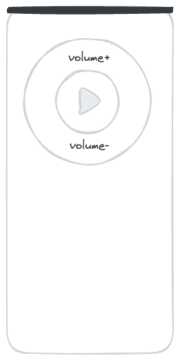

# The Box'a hoş geldiniz

Merhaba ve “Kutu”ya hoş geldiniz! Seyahat ederken AirBnB'lerde kalmayı da severim ve bazen konaklama, giriş ve çıkış hakkında gerekli tüm bilgileri içeren bir kağıt parçasına sahip olmayı dilerdim ve bu benim bunu daha iyi hale getirme girişimimdir.

> [!Bir uyarı]Belgenin otomatik olarak dilinize çevrilmesini sağlayacağım. Umarım biraz anlaşılır olmuştur. Değilse, bana bir mesaj yazmaktan çekinmeyin. Daha sonra onu geliştirmeye çalışıyorum.

## Resimler

AirBnB'mde tüm odalara ve olanaklara ilişkin ayrıntılı bir genel bakış bulacaksınız. İşte kısa bir genel bakış:

|           |    |  |
| -------------------------------------------------------------------------------------- | ----------------------------------------------------------------------------- | --------------------------------------------------------------------------------------- |
| Kanepeli tek yatak konfigürasyonu                                                      | İki yataklı konfigürasyon                                                     | Çalışma masası                                                                          |
|  |            |                          |
| Işıklı çalışma masası                                                                  | Mutfak - ocak                                                                 | Mutfak - çay                                                                            |
|            |  |            |
| Işıklı çalışma masası                                                                  | Mutfak - ocak                                                                 | Mutfak - çay                                                                            |

## Anahtar

Her biri alt için bir anahtar ve üst için bir anahtar içeren iki çift anahtar alırsınız. Anahtarlığın üzerinde odanızı kilitlemek için kullanabileceğiniz bir anahtar da bulunmaktadır.

## internet girişi

```txt
SSID:     hamburg-bei-nacht
Passwort: landungsbruecken
```

Veya bu QR kodunu tararsınız, sizi otomatik olarak ağa bağlayacaktır:


# Odalar


## Mutfak

Genellikle ailemle birlikte alt katta yemek yediğim için mutfak oldukça sade. Ne yazık ki bulaşık yıkamak sadece banyodaki lavaboda yapılabilmektedir. Ancak bulaşık yıkamak için özel bir kap var.


### Mutfakta aşağıdaki şeyler mevcuttur

1.  Sürü
2.  Su ısıtıcısı
3.  Çatal bıçak takımı
4.  Buzdolabı
5.  Pizza fırını
6.  Maden suyu
7.  Rafta cep telefonu şarj istasyonu
8.  çamaşır makinesi

### SSS - Mutfak

1.  Ocak çalışmıyor mu? lütfen söyle
    > "Bilgisayar, Tezgah ve"
2.  Nerede yıkanabilirim? Bu sadece banyoda işe yarar. Bulaşıkları yıkamak için özel bir kap bulunmaktadır.

## Senin odan

Yataklar yalnızca depolama amacıyla üst üste yerleştirilir. İhtiyaçlarınıza göre dağıtabilirsiniz.
Kanepedeki yastıkları şilteyle değiştirirseniz yatak olarak işe yarar.

### Bilgisayarın (iMac) oturum açma ayrıntıları şunlardır:

```txt
Nutzer:   thebox
Passwort: thebox
```

### Odada aşağıdaki şeyler mevcuttur

1.  Tüm mobilya ve yataklar
2.  Bilgisayarlar ve Yazıcılar
3.  Işıklar ve elektrik için uzaktan kumandalar

### Uzaktan kumandalar

Tüm uzaktan kumandalar için eski bir Alman atasözü geçerlidir: “Denemek çalışmaktan iyidir”. Hiçbir şeyi kıramazsın. Birkaç düğmeye basın ve ne olacağını görün. Hala ders çalışmak istiyorsanız işte size uygun okumalar:

| İllüstrasyon                                              | Tanım                                                                                                                                                                                                                                                 |
| --------------------------------------------------------- | ----------------------------------------------------------------------------------------------------------------------------------------------------------------------------------------------------------------------------------------------------- |
|   | C: Bluetooth kutusu<br>B: Peri ışıkları<br>C: Masa lambası<br>D:_dosya_<br>Usta: Her şeyi aynı anda değiştirin                                                                                                                                        |
|  | **Kullanmadan önce girişteki ışık anahtarının "açık" konumda olduğundan emin olun.**<br>İlk satır: parlaklık, açık/kapalı<br>Renkli düğmeler: Renkleri değiştirmek için bunu kullanabilirsiniz.<br>Gri düğmeler: Farklı efektler arasında geçiş yapın |
|     | Bu, bilgisayarın (iMac) uzaktan kumandasıdır._Bilgisayarı kullanmak için ilk uzaktan kumandadaki A düğmesine basın. Bilgisayarın ve Bluetooth kutusunun güç kaynağını etkinleştirir._                                                                 |

### SSS - Odanız

1.  Işık yanmıyor veya çılgınca yanıp sönüyor Renkli düğmelere sahip küçük uzaktan kumandayı kullanın.

### banyo

Duşu ayakta kullanabilirsiniz. Zeminin biraz ıslanması sorun değil. Suyu yalnızca 1/3 oranında açın ve banyo paspasını kuruması için ısıtıcının üzerine asın.

Duvardaki Alexa "Bilgisayar" adını alır ve aynı zamanda en sevdiğiniz müziği veya radyoyu da çalar. Örneğin. "_Bilgisayar, Deutschlandfunk Nova'yı oyna_"

Tüm kancalara havlu asabilir, eşyalarınızı istediğiniz yere koyabilirsiniz. Banyo kapısının önünde raf bulunmaktadır. Bunlardan biri senin.

### Koridor

Ayakkabılarınızı burada bırakabilirsiniz. Bana bir şey söylemek istersen diye rafta küçük bir not defterim de var.

# Çeşitli

## Akıllı ev

Banyo ve mutfakta Alexa sesli asistanları bulunmaktadır. Onlara “Bilgisayar” adıyla hitap edebilir ve örneğin Deutschlandfunk Nova oynamalarını sağlayabilirsiniz. Almancayı ve İngilizceyi de anlıyorlar. Bunları kullanmak istemiyorsanız,
Ayrıca basitçe güç kaynağından bağlantısını kesebilirsiniz.

Odanızda sesli asistan yok. Raftaki sepette yalnızca yönlendirici ve küçük bir bilgisayar bulunmaktadır.

## sıcaklık ve nem

Sıcaklık ve nem sensörler aracılığıyla otomatik olarak ölçülür. Küf oluşumunu engellemek için kullanıyorum. Küçük ve beyazdırlar ve genellikle kapı çerçevelerinde bulunurlar. Ölçüm verilerinin bir kısmını koridordaki aynada okuyabilirsiniz.

?> Lütfen düzenli olarak (günde en az bir kez) havalandırmaya dikkat edin. Özellikle banyoda. Ayrıca ısıtmanın kapalı olduğundan emin olun. Teşekkür ederim 🙏

## Yarda

Avlumuzda bisikletlerinizi bağlayabilir ve çöplerinizi atabilirsiniz.


### Kapı nasıl açılıyor?

Ya ön kapının anahtarını kullanırsınız ya da kapıdan içeri girip kapıyı açmak için düğmeye dokunursunuz. Düğmeyi basılı tuttuğunuzda kapıyı açabilirsiniz.


### Sarı? Mavi? Yeşil? Kahverengi?

Çöp kutularının neden farklı renklerde olduğunu merak ediyor musunuz? Emin değilseniz çöpü her zaman yeşil çöp kutusuna atın. Geriye kalan atıklar orada bitiyor. Profesyoneller kağıt atıklarını mavi çöp kutusuna, geri dönüştürülebilir atıkları sarı çöp kutusuna ve organik atıkları kahverengi çöp kutusuna koyuyor.

### Döngüler

### Bisikletim güvende mi?

Leipzig bisiklet dostu bir şehir. Şehri ikiye bölen büyük şehir parkı sayesinde birçok yere ulaşabilir ve genellikle kırsal kesimden geçebilirsiniz.
İstatistiklere inanıyorsanız, her yıl kişi başına en fazla bisikletin çalındığı yer Leipzig'dir. (100.000 kişi başına 1.539 çalıntı bisiklet) Hardenbergstraße'de yaşadığım 15 yıldan bu yana hiç bisikletim çalınmadı ve sadece arka bahçesinden bisikleti çalınan bir komşu tanıyorum. Her zaman doğrudan korkuluğa bağlarım.

### Hangi alternatifler var?

İle[Leipzig MOVE Uygulaması](https://leipzig-move.de/), her biri 15 dakikalık 10 ücretsiz sürüşe sahip olursunuz._Sonraki bisikletler_. Bisikletlerinizi ana caddelere (haritada mor) park etmezseniz daha pahalıya mal olacağını unutmayın. E-scooter'lar yalnızca belirli park yerlerine park edilebilir. Ayrıca halka açık bir araç paylaşım sistemi de bulunmaktadır. Bunun anlamı bizimle[Şehirflitzer](https://cityflitzer.de/). Ve elbette Leipzig MOVE uygulaması aracılığıyla ödeme yapabileceğiniz otobüsler ve trenler de var.

# Çıkış yapmak

## Anahtar

-   Haftanın hangi günü olduğuna bağlı olarak bizzat veda edebiliriz ya da anahtarları masanın üzerine koyup kapıyı arkanızdan kapatabilirsiniz.
-   Çıkış günü son çıkış saati saat 19.00'dır.

## temizlik

-   Üzerinde nevresim bırakabilirsiniz.
-   Bulaşıkları da yıkıyorum
-   Çöpü de dışarı çıkarıyorum.

> Kısa versiyon: Anahtarı orada bırakın, kapıyı kapatın, bu kadar. 😀

# Daha uzun konaklama

?> Bazı misafirlerim bir ay veya daha uzun süre kalıyor. Eğer siz de onlardan biriyseniz bu bölüm tam size göre!

## çamaşır makinesi

Çamaşır makinesini sormanıza gerek kalmadan kullanabilirsiniz. Kurutma rafını, çamaşır tozunu ve yumuşatıcıyı da kullanabilirsiniz. Yeni nevresimler istiyorsanız benimle konuşmanız yeterli.

## El fırçası ve faraş

Mutfakta duvarda bir el fırçası ve faraş bulacaksınız. Bu, küçük kirlerden kurtulmanıza yardımcı olacaktır.

## Silip süpürmek

Paspaslamak için yeşil temizlik maddesini banyoda sprey şişesinde bulabilirsiniz. Mutfak kağıdıyla birlikte yüzeyleri kolayca temizlemek için kullanılabilir.

## Elektrikli süpürge

Zemin için bir robot elektrikli süpürgem var.
Başlamadan önce yerdeki her şeyi temizleyin.
Özellikle robotun boğulabileceği kablolar veya diğer şeyler.
Daha sonra odanıza koyun ve üstteki düğmeye bir kez basın.
Hiçbir şey olmazsa yan taraftaki açma/kapama düğmesini kullanın ve ardından
üstteki düğmeyi kullanarak tekrar açın.

Bittiğinde lütfen şarj istasyonuna geri koyun!

# İpuçları

İle[Leipzig MOVE Uygulaması](https://leipzig-move.de/), her biri 15 dakikalık 10 ücretsiz sürüşe sahip olursunuz._Sonraki bisikletler_.
Raf'ı ana caddelere (haritada mor) park etmezseniz daha pahalıya mal olacağını unutmayın.
E-scooter'lar yalnızca belirli park yerlerine park edilebilir.

Seyahat rehberlerini AirBnB uygulamasında sakladım. Orada turistik yerler, barlar ve publar, alışveriş fırsatları ve restoranlarla ilgili önerilerimi bulacaksınız.

# Sorunuz mu var?

Herhangi bir sorunuz varsa veya desteğe ihtiyacınız varsa, size yardımcı olmaktan memnuniyet duyarım.
Aceleniz varsa bunu telefonla yapmak en iyisidir. <a href="tel:+491707353067">+49 170 73 53 067</a>.
Sınırlı işlevselliğe (SMS) sahip, önceden yüklenmiş mesajlaşma uygulamasını da kullanabilirsiniz.
Aksi takdirde koridorda bir not defterim ve bir kalemim var.

Leipzig'de güzel bir konaklama geçirmenizi dilerim!
André

* * *

_tarafından ❤️ ile yapılmıştır [belgelemek](https://docsify.js.org/)_
