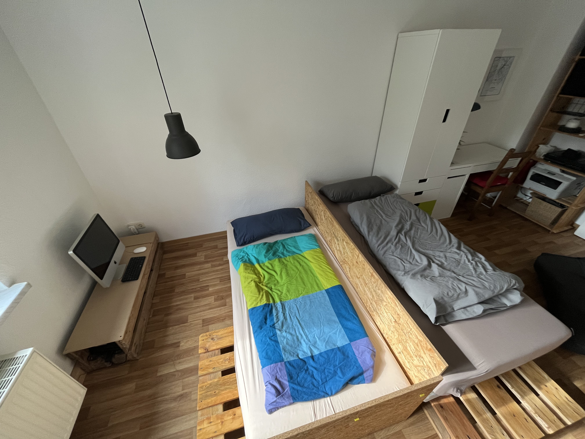

# Ласкаво просимо

Привіт і ласкаво просимо до “Скриньки”! Коли я подорожую, я також люблю зупинятися в AirBnB, і іноді мені шкода, щоб у мене був аркуш паперу з усією необхідною інформацією про помешкання, реєстрацію та виселення, і це моя спроба зробити це краще.

## Картинки

На моєму AirBnB ви отримуєте детальний огляд усіх номерів і зручностей. Ось лише короткий огляд:

<div class="grid">

<figure>


<figcaption>Zimmer - Ein-Bett-Konfiguration</figcaption>
</figure>

<figure>


<figcaption>Zimmer - Schreibtisch</figcaption>
</figure>

<figure>


<figcaption>Zimmer - Schreibtisch</figcaption>
</figure>

<figure>


<figcaption>Zimmer - Zwei-Bett-Konfiguration</figcaption>
</figure>

<figure>



<figcaption>Zimmer - Zwei-Bett-Konfiguration</figcaption>
</figure>

<figure>


<figcaption>Küche - Herd</figcaption>
</figure>

</div>

|  |  |  |
| -------------------------------------------------------------------------------------- | --------------------------------------------------------------------------------------- | --------------------------------------------------------------------------------------- |
| кухня                                                                                  | погано                                                                                  | Zimmer                                                                                  |

|  |  |  |
| -------------------------------------------------------------------------------------- | --------------------------------------------------------------------------------------- | --------------------------------------------------------------------------------------- |
| кухня                                                                                  | погано                                                                                  | Zimmer                                                                                  |

# Перевірь

## ключ

Ви отримуєте дві пари ключів, кожна з яких має один ключ для нижньої та один для верхньої частини. Також на брелоку є ключ, яким можна замкнути свою кімнату.

## Доступ в інтернет

```txt
SSID:     hamburg-bei-nacht
Passwort: landungsbruecken
```

Або відскануйте цей QR-код, він автоматично підключить вас до мережі:


# Кімнати


## кухня

Оскільки я зазвичай їм внизу зі своєю сім’єю, кухня дуже спартанська. На жаль, мити посуд можна тільки в раковині у ванній кімнаті. Але є спеціальна ємність для миття посуду.


### Вам доступні наступні речі

1.  стадо
2.  Чайник
3.  Посуд столові прибори
4.  Холодильник
5.  Піцаоф
6.  Мінеральна вода
7.  Станція для зарядки мобільного телефону на полиці
8.  пральна машина

### FAQ - Кухня

1.  Плита не працює? будь ласка, скажи
    > «Комп’ютер, робочий стіл»
2.  Де я можу помитися? Це працює лише у ванній кімнаті. Є спеціальна ємність для миття посуду.

## Ваша кімната

Матраци кладуть один на одного лише для зберігання. Ви можете розподілити їх відповідно до ваших потреб. Якщо замінити подушки на дивані матрацом, то вийде гарне ліжко.

Ви можете користуватися комп’ютером і принтером.

### Дані для входу на комп’ютер є

```txt
Nutzer:   thebox
Passwort: thebox
```

### Вам доступні наступні речі

1.  Всі меблі та ліжка
2.  комп'ютер
3.  Пульти дистанційного керування світлом та електрикою

### FAQ - Ваша кімната

1.  Лампа не світиться або дико блимає. Використовуйте маленькі пульти дистанційного керування з кольоровими кнопками.

### ванна кімната

Можна користуватися душем стоячи. Не біда, якщо земля трохи промокне. Увімкніть воду лише на 1/3 і повісьте килимок для ванної над обігрівачем, щоб він висох.

Alexa на стіні має назву «Комп’ютер» і також відтворює вашу улюблену музику чи радіо. наприклад "_Комп’ютер, грай у Deutschlandfunk Nova_"

Ви можете вішати рушники на всі гачки і складати свої речі куди завгодно.

### Передпокій

Ви можете залишити своє взуття тут. У мене також є маленький блокнот на полиці, якщо ви захочете мені щось розповісти.

# Різне

## Smart Home

У квартирі є голосові помічники Alexa. Ви можете звернутися до них на ім’я «Комп’ютер» і попросити їх зіграти, наприклад, Deutschlandfunk Nova. Пристрої підключені до Інтернету, а також можуть використовуватися як будильники або таймери. Якщо ви не хочете ним користуватися, ви можете просто відключити його від джерела живлення.

У вашій кімнаті немає голосових помічників. У кошику на полиці тільки роутер і маленький комп'ютер.

## температура і вологість

Температура і вологість автоматично вимірюються за допомогою датчиків. Я використовую їх для запобігання утворенню цвілі. Вони маленькі й білі й зазвичай лежать на дверних рамах. Ви можете використовувати частину даних вимірювання
Читаю тебе в дзеркалі в коридорі.

# Перевірити

## ключ

-   Залежно від того, який сьогодні день тижня, ми можемо попрощатися особисто, або ви можете просто покласти ключі на стіл і зачинити за собою двері.
-   Звичайний час виписки – 11:00.
-   Якщо ви бажаєте залишити свій багаж у день відправлення та забрати його лише пізніше, ми можемо організувати це індивідуально.

## очищення

-   На ньому можна залишати постільну білизну.
-   Я також мию посуд і
-   Я також виношу сміття.

> Коротка версія: залиш ключ там, закрий двері, і все. 😀

# Поради

З додатком Leipzig MOVE ви отримуєте 10 безкоштовних поїздок по 15 хвилин кожна_Nextbikes_. Зауважте, що це коштує дорожче, якщо ви не паркуєте велосипеди на головних вулицях (фіолетовий на карті). Електроскутери можна паркувати лише на певних паркувальних місцях.

# Запитання?

Якщо у вас виникли запитання або потрібна допомога, я буду радий вам допомогти. Якщо ви поспішаєте, то найкраще це зробити по телефону <a href="tel:+491707353067">+чя 170 щз 53 067</a>. Ви також можете використовувати попередньо встановлену програму обміну повідомленнями з обмеженою функціональністю (SMS). Інакше у мене в коридорі є блокнот і ручка.

Бажаю вам приємного перебування в Лейпцигу!
Андре

* * *

_Зроблено за допомогою ❤️ [документувати](https://docsify.js.org/)_
