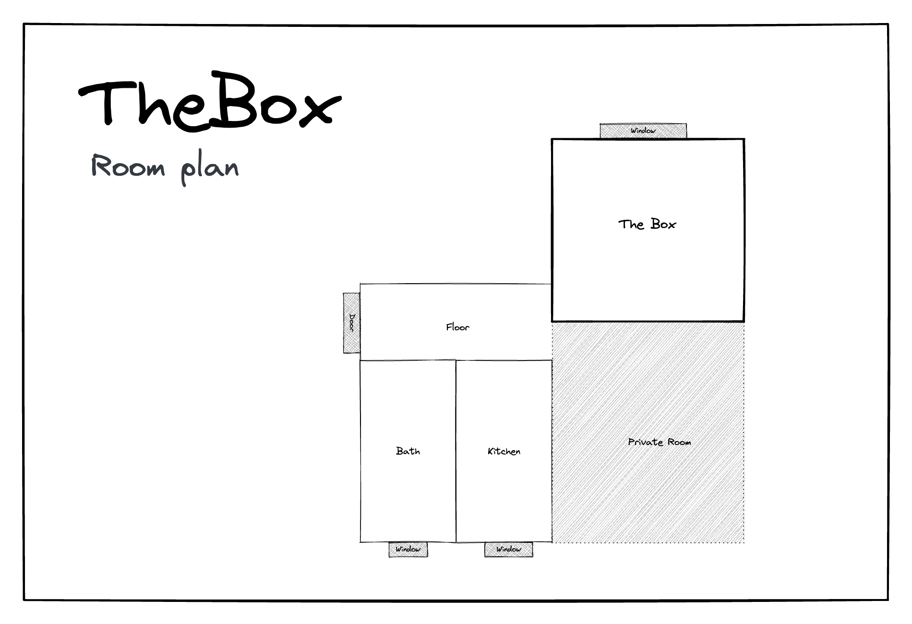

# Коробка

Привіт і ласкаво просимо до «Скриньки»! Коли я подорожую, я також люблю зупинятися в AirBnB, і іноді мені шкода, щоб у мене був аркуш паперу з усією необхідною інформацією про проживання, реєстрацію та виселення, і це моя спроба зробити це краще:

## Перевірь

### ключ

Ви отримуєте дві пари ключів, кожна з яких має один ключ для нижньої та один для верхньої частини. Також на брелоку є ключ, яким можна замкнути свою кімнату.

### Доступ в інтернет

```txt
SSID:     hamburg-bei-nacht
Passwort: landungsbruecken
```

Або відскануйте цей QR-код, він автоматично підключить вас до мережі:

\|

## Кімнати



### Детальний вигляд


### кухня

Оскільки я зазвичай їм внизу зі своєю сім’єю, кухня дуже спартанська. На жаль, мити посуд можна тільки в раковині у ванній кімнаті.

**Вам доступні такі речі:**

1.  стадо
2.  Чайник
3.  Посуд столові прибори
4.  Холодильник
5.  Піцаоф
6.  Мінеральна вода
7.  Станція для зарядки мобільного телефону на полиці
8.  пральна машина

**Плита не працює?**Будь ласка, скажіть:

> «Комп’ютер, робочий стіл»

#### Ваша кімната

**Матраци**призначені лише для зберігання

* * *

_Зроблено за допомогою ❤️[документувати](https://docsify.js.org/)_
