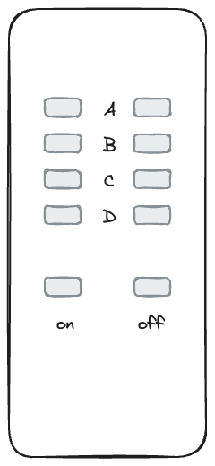

# 欢迎

您好，欢迎来到“盒子”！当我旅行时，我也喜欢住在爱彼迎，有时我希望能有一张纸，上面有关于住宿、入住和退房的所有必要信息，这是我试图让它变得更好的尝试。

## 图片

在我的爱彼迎上，您可以详细了解所有房间和设施。这里只是一个简短的概述：

|           |    |  |
| -------------------------------------------------------------------------------------- | ----------------------------------------------------------------------------- | --------------------------------------------------------------------------------------- |
| 一张床配置，带沙发                                                                              | 两张床配置                                                                         | 桌子                                                                                      |
|  |            |                          |
| 带灯书桌                                                                                   | 厨房-炉灶                                                                         | 厨房-茶                                                                                    |
|            |  |            |
| 带灯书桌                                                                                   | 厨房-炉灶                                                                         | 厨房-茶                                                                                    |

# 报到

## 钥匙

您将获得两对钥匙，每对钥匙位于底部，另一对用于顶部。钥匙链上还有一把钥匙，可以用来锁房间。

## 互联网

```txt
SSID:     hamburg-bei-nacht
Passwort: landungsbruecken
```

或者您扫描此二维码，它会自动将您连接到网络：


# 房间

!\[[thebox-map.png]]

## 厨房

由于我通常和家人一起在楼下吃饭，所以厨房非常简陋。不幸的是，洗漱只能在浴室的水槽里进行。但有一个专门的容器可以用来清洗。


### 以下内容可供您使用

1.  一群
2.  壶
3.  餐具餐具
4.  冰箱
5.  披萨
6.  矿泉水
7.  架子上的手机充电站
8.  洗衣机

### 常见问题解答 - 厨房

1.  炉子不工作？请说
    > “计算机、工作台和”
2.  哪里可以洗？这只适用于浴室。有一个专门用来洗碗的容器。

## 你的房间

床垫叠放在一起仅用于存放目的。您可以根据您的需要分发它们。如果你把沙发上的垫子换成床垫，它就是一张好床。

欢迎您使用电脑和打印机。

### 计算机的登录详细信息是

```txt
Nutzer:   thebox
Passwort: thebox
```

### 以下内容可供您使用

1.  所有家具和床
2.  电脑
3.  远程控制灯光和电力

### 遥控器

| 插图                                                        | 描述                                                                               |
| --------------------------------------------------------- | -------------------------------------------------------------------------------- |
|   | 答：蓝牙盒子<br>B：仙女灯<br>C：台灯<br>d:_文件_<br>大师：同时切换所有内容                                 |
|  | **在使用之前，请确保入口处的电灯开关设置为“打开”。**<br>第一行：亮度、开/关<br>彩色按钮：您可以使用它来更改颜色<br>灰色按钮：不同效果之间切换 |

### 常见问题 - 您的房间

1.  灯不亮或闪烁得厉害。请使用带有彩色按钮的小遥控器。

### 浴室

您可以站着使用淋浴。如果地面有点湿也没有问题。仅将水开到 1/3，然后将浴垫挂在加热器上晾干。

墙上的 Alexa 名称为“计算机”，还可以播放您最喜欢的音乐或收音机。例如“_电脑上，玩 Deutschlandfunk Nova_"

您可以将毛巾挂在所有挂钩上，并将物品放在任何地方。

### 门厅

欢迎您把鞋子留在这里。我的架子上还有一个小记事本，以防你想告诉我一些事情。

# 各种各样的

## 智能家居

公寓内有Alexa语音助手。例如，您可以用“计算机”这个名字来称呼他们，并让他们玩 Deutschlandfunk Nova。这些设备连接到互联网，也可以用作闹钟或计时器。如果您不想使用它，只需将其从电源上拔掉即可。

您的房间里没有语音助手。架子上的篮子里只有路由器和一台小电脑。

## 温度和湿度

温度和湿度通过传感器自动测量。我用它们来防止霉菌形成。它们又小又白，通常放在门框上。您可以在走廊的镜子中读取一些测量数据。

> 请确保定期通风（至少每天一次）。尤其是在浴室里。还要确保暖气已关闭。谢谢🙏

## 院子

在我们的庭院里，您可以连接自行车并带走垃圾。


### 门怎么打开？

您要么使用前门钥匙，要么伸手穿过大门并感觉到开门按钮。当您按住按钮时，您可以打开门。

!\[[环境按钮-jpeg.]]

### 黄色的？蓝色的？绿色的？棕色的？

你想知道为什么垃圾桶有不同的颜色吗？如果您不确定，请将垃圾放入绿色垃圾桶。残留的废物最终会在那里。专业人士将纸张垃圾放入蓝色垃圾箱，将可回收物放入黄色垃圾箱，将有机垃圾放入棕色垃圾箱。

### 周期

### 我的自行车安全吗？

莱比锡是一个非常适合骑自行车的城市。通过将城市分为两半的大型城市公园，您可以到达许多地方，通常开车穿过乡村。
如果您相信统计数据，那么莱比锡每年的人均自行车被盗数量最多。 （每 100,000 名居民就有 1,539 辆自行车被盗）自从我住在 Hardenbergstraße 以来的 15 年里，我从未遇到过自行车被盗的情况，我只知道一位邻居的自行车在他的后院被盗。我总是将它直接连接到栏杆上。

### 还有哪些替代方案？

随着[莱比锡 MOVE 应用程序](https://leipzig-move.de/)，您将获得 10 次免费乘车机会，每次 15 分钟_下一个自行车_。请注意，如果您不在主要街道上停放自行车（地图上的紫色），费用会更高。电动滑板车只能停放在某些停车位。还有一个自由流动的汽车共享系统。这意味着我们[城市飞行者](https://cityflitzer.de/)。当然，您还可以通过 Leipzig MOVE 应用程序支付巴士和火车的费用。

# 查看

## 钥匙

-   根据一周中的哪一天，我们可以亲自道别，或者您也可以简单地将钥匙放在桌子上，然后关上身后的门。
-   正常退房时间为上午 11 点。
-   如果您想在出发当天寄存行李并仅在当天晚些时候领取，我们可以单独安排。

## 打扫

-   您可以在上面留下床上用品。
-   我也洗碗
-   我也倒垃圾。

> 简短版本：把钥匙留在那里，关上门，就这样。 😀

# 尖端

使用 Leipzig MOVE 应用程序，您可以免费乘坐 10 次，每次 15 分钟_下一个自行车_。请注意，如果您不在主要街道上停放自行车（地图上的紫色），费用会更高。电动滑板车只能停放在某些停车位。

# 问题？

如果您有任何疑问或需要支持，我将很乐意为您提供帮助。如果您赶时间，最好通过电话联系 <a href="tel:+491707353067">+49 170 73 53 067</a>。您还可以使用功能有限的预装消息应用程序 (SMS)。除此之外，我在走廊里有一个记事本和一支笔。

祝您在莱比锡过得愉快！
安德烈

* * *

_由 ❤️ 制作 [文档化](https://docsify.js.org/)_
